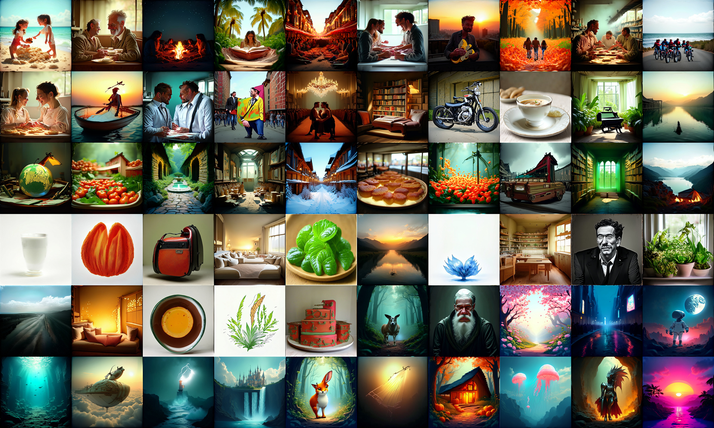
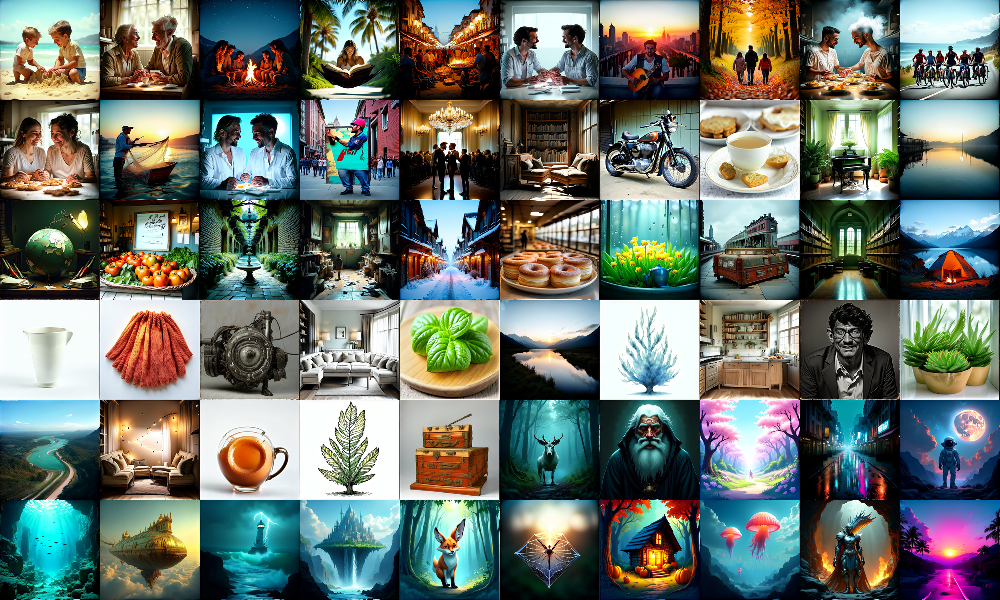
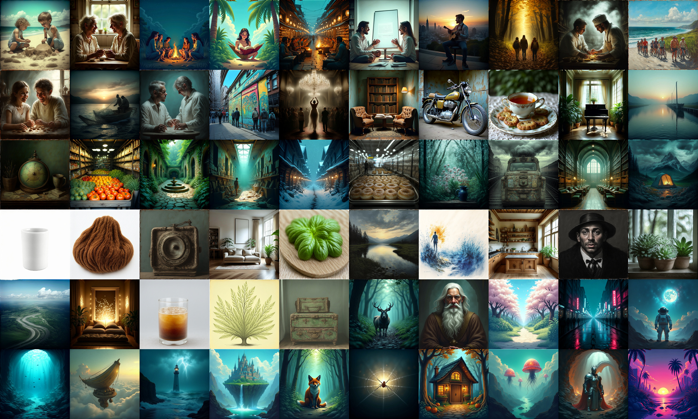
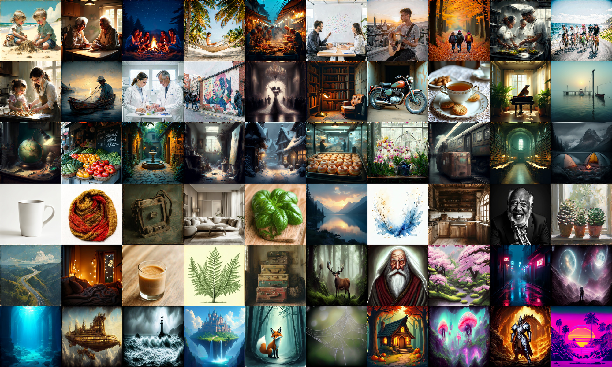

# PIERROT 0.8B (phase2) — step별 샘플 관찰 기록

작성일: 2026-07-09

이 문서는 PIERROT 0.8B 모델(phase2 base 학습)이 학습 step이 늘어남에 따라 실제로 어떻게 변해 가는지를, 매번 똑같은 조건으로 뽑은 샘플 그리드로 기록한 것이다. 목적은 하나다. **"몇 step 짜리 체크포인트가 어떤 그림을 그리는가"를 눈으로 바로 비교할 수 있게 하는 것.**

숫자 지표(FID 등)는 여기 없다. 이 문서는 사람이 눈으로 본 관찰만 담는다. 원인 분석과 데이터셋 진단은 이 문서의 범위가 아니다.

같은 형식의 1.6B(phase3) 기록은 [1.6b_training_review.md](1.6b_training_review.md)에 있다.

## 1. 어떻게 뽑았나 (재현 조건)

모든 그리드는 **완전히 동일한 조건**으로 생성했다. 체크포인트만 바꿨다. 그래서 그리드끼리 나란히 놓고 비교하면 차이는 오직 학습 step에서 온 것이다.

| 항목 | 값 |
| --- | --- |
| 프롬프트 | base prior 학습셋의 캡션 스타일을 흉내 낸 신규 60개 (학습 캡션 복사 아님) → **[baseprior_prompts.json](baseprior_prompts.json)** |
| 프롬프트 계열 | 자연 서술형 15 / 상세 묘사형 15 / 짧은 웹 캡션 15 / 아티스틱 키워드형 15 |
| 해상도 | 1024 × 1024 |
| 샘플링 step | 28 |
| guidance scale (CFG) | 4.0 |
| 난수 seed | 42 (프롬프트마다 고정) |
| chi_prompt | OFF |
| 가중치 | EMA 체크포인트 (`ema.pt`) |
| 그리드 배치 | 10열 × 6행, 타일 400px, 여백 없음 |

프롬프트 60개는 **[baseprior_prompts.json](baseprior_prompts.json)** 에 전문이 들어 있다. 생성 조건(해상도·step·CFG·seed·그리드 배치)도 같은 파일의 `generation` 항목에 함께 담겨 있어, 이 파일 하나만 있으면 그리드를 그대로 재현할 수 있다.

| 계열 (`style`) | id 범위 | 캡션 스타일 출처 | 설명 |
| --- | --- | --- | --- |
| `natural_scene` | 1–15 | flux_generated | 자연 서술형 다중 주체 장면 |
| `detailed_scene` | 16–30 | flux_reason | 디테일 풍부한 단일 장면 묘사 |
| `short_web_caption` | 31–45 | cc12m | 짧은 웹/제품 캡션 |
| `artistic_keywords` | 46–60 | diffusiondb | 아티스틱 키워드 나열형 |

그리드에서 타일은 `id` 오름차순으로 배치된다(왼쪽→오른쪽, 위→아래). 즉 첫 줄 10칸이 id 1–10이고, 마지막 줄이 id 51–60이다. 어떤 타일이 어떤 프롬프트인지 세어서 찾을 수 있다.

seed가 고정이라 **같은 체크포인트를 다시 돌리면 픽셀 단위로 같은 결과**가 나온다. 즉 아래 이미지들은 재현 가능하다.

> 저장소에는 용량 때문에 압축본(JPEG, 폭 2000px)만 올려 두었다. 원본 PNG(4000×2400)는 개별 이미지 60장으로부터 언제든 다시 조립할 수 있다.

## 2. 한눈에 보는 요약

0.8B의 학습 궤적은 "깨끗함 → 회화풍(painterly)으로 물듦 → 다시 사실적으로 회복"이라는 U자 모양을 그린다.

| step | 색감 | 사실성 | 한 줄 평 |
| --- | --- | --- | --- |
| 0.5M | 과포화된 따뜻한 색(오렌지 편향) | 낮음 | 구도는 잡혔으나 형태가 무너짐 |
| 1.0M | 중립·균형 | 중간 | **초기 구간 중 가장 깨끗** |
| 1.5M | 따뜻한 세피아(sepia, 갈색조) | 높음 | 유화 느낌이 스며들기 시작 |
| 2.0M | 차갑고 탁한 청록(teal-green) | 높음 | **회화풍이 가장 강한 지점** |
| 2.5M | 자연스러운 균형 | 매우 높음 | 사실적 사진톤으로 회복 |
| 2.74M | 사실적, 은은한 웜톤 | 가장 높음 | 현재 최상 |

여기서 "회화풍(painterly)"이란, 사진을 요청했는데도 붓질 질감·과장된 명암·유화 같은 색층이 나타나는 현상을 말한다. 프롬프트가 시키지 않았는데도 모델이 스스로 그 스타일로 가는 것이라, 무조건적(unconditional) 편향에 가깝다.

## 3. step별 그리드

### 3.1 step 0.5M — 초기 형성기

- **색**: 오렌지·붉은 계열로 강하게 치우쳤고 채도가 과하다. 낙엽길·모닥불·찻잔이 특히 과포화된다.
- **형태**: 오토바이, 여행가방, 손가락 같은 구조물이 무너진다. 배경은 단순하게 뭉개진다.
- **잘 되는 것**: 프롬프트가 요구한 주제와 구도는 이미 정확히 맞춘다. 무엇을 그릴지는 알지만, 어떻게 그릴지는 아직 모르는 단계.

### 3.2 step 1.0M — 색균형이 잡히는 시점

- **색**: 0.5M의 과포화가 사라지고 중립에 가까워진다. 오히려 약간 서늘한 쪽.
- **형태**: 오토바이의 크롬, 찻잔의 반사, 거실 가구가 또렷해진다. 명암 표현이 확실히 좋아졌다.
- **평가**: 스타일 편향이 가장 적은 구간이다. 이후 구간과 비교하면 이 지점이 얼마나 "중립적"인지가 드러난다.

### 3.3 step 1.5M — 회화풍이 스며들기 시작

- **색**: 어둡고 따뜻한 세피아(갈색조) 캐스트가 전반에 깔린다. 지구본·시장·주방·침실이 모두 같은 톤으로 수렴한다.
- **질감**: 사실성 자체는 1.0M보다 올랐지만, 사진이라기보다 **유화 같은 색층**이 보인다.
- **의미**: 모델이 특정 스타일 쪽으로 끌려가기 시작한 첫 신호다.

### 3.4 step 2.0M — 회화풍의 정점

- **색**: 1.5M의 따뜻한 갈색과 달리 **차갑고 탁한 청록(teal-green)** 으로 전체가 통일된다.
- **질감**: 시장·골목·숲·마법사·찻잔 등 대부분이 유화처럼 렌더링된다. "사진처럼(photorealistic)"이라고 명시한 프롬프트조차 회화로 나온다.
- **평가**: 관찰한 모든 0.8B 체크포인트 중 스타일 편향이 가장 심하다.

### 3.5 step 2.5M — 회복 구간

- **색**: 청록 캐스트가 옅어지고 색균형이 자연스러워진다.
- **질감**: 오토바이·찻잔·낙엽길·자전거 무리가 다시 사실적 사진톤으로 돌아온다. 2.0M에서 쌓인 디테일은 유지된 채 스타일만 정상화됐다.

### 3.6 step 2.74M — 현재 최상

- **색**: 사실적. 은은한 시네마틱 웜톤이 남아 있지만 거슬리는 수준은 아니다.
- **질감**: 질감·사실성 모두 관찰 구간 중 최고. 인물 피부, 금속 반사, 음식 표면이 자연스럽다.
- **남은 아쉬움**: 어둡고 따뜻한 톤의 잔향은 여전히 base 전반에 옅게 깔려 있다.

## 4. 이 기록에서 읽어야 할 것

- **step이 늘수록 무조건 좋아지지 않는다.** 1.0M은 2.0M보다 스타일 면에서 오히려 중립적이다. 사실성과 스타일 중립성은 따로 움직인다.
- **스타일 편향은 서서히 쌓이고 서서히 빠진다.** 1.5M에서 스며들어 2.0M에서 정점을 찍고 2.5M에서 빠졌다. 한두 checkpoint만 보고 판단하면 놓친다.
- **그래서 중간 체크포인트를 주기적으로 뽑아 봐야 한다.** 손실 곡선(loss curve)은 이 변화를 거의 알려주지 않는다.

이 그리드들은 모두 하나의 이어지는 학습 run에서 나왔다(step과 날짜가 모두 단조 증가). 따라서 "2.0M 정점 후 회복"은 학습을 되돌린(rollback) 결과가 아니라, run 내부에서 자연히 지나간 궤적이다.

## 5. 관련 문서

- [1.6b_training_review.md](1.6b_training_review.md) — 1.6B(phase3, depth growth) 모델의 같은 형식 기록
- [SFT.md](SFT.md) — phase2 base 이후 SFT 실험 일기
