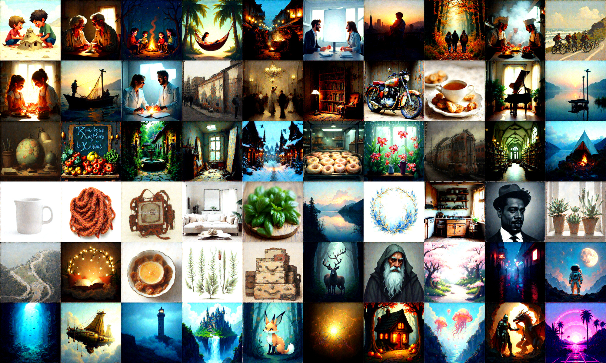
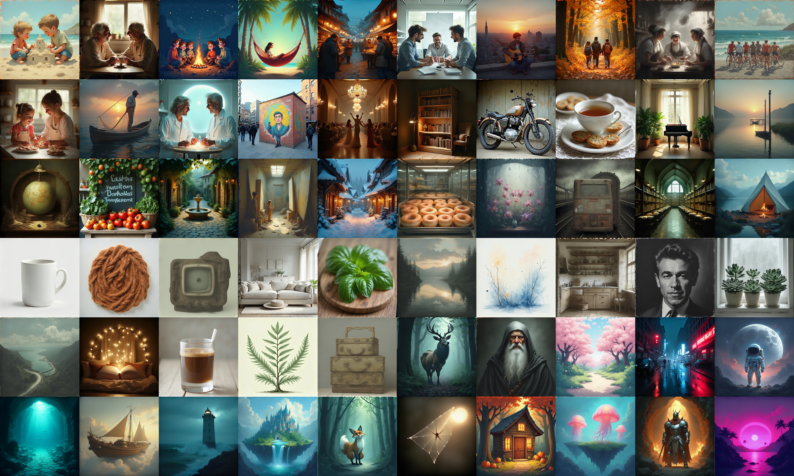
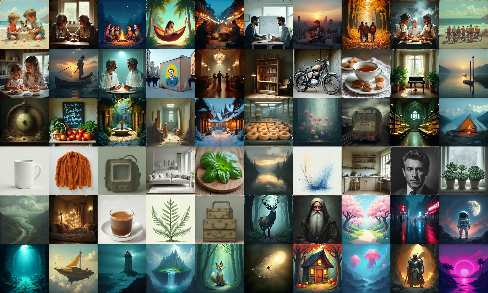
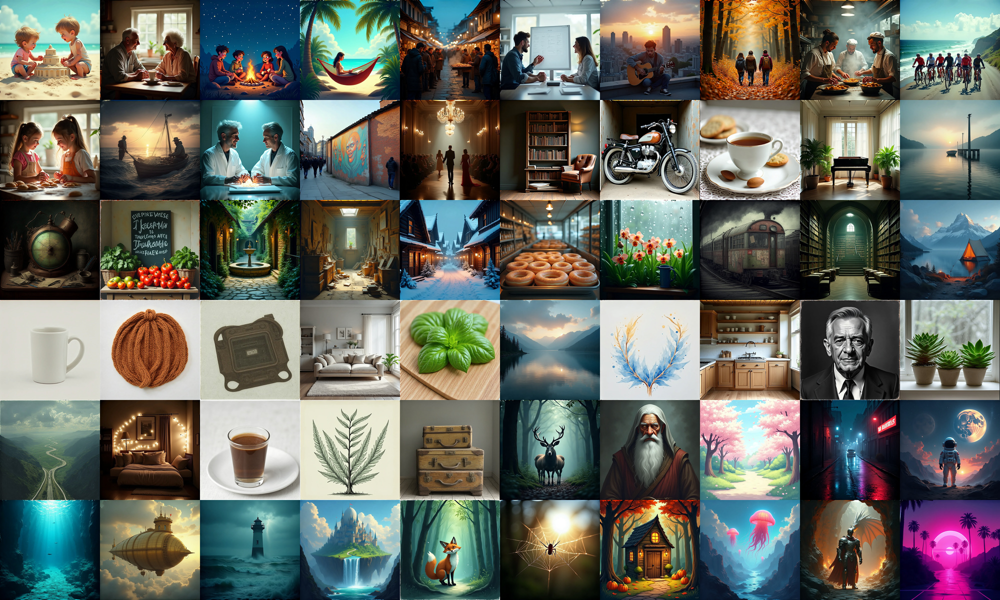
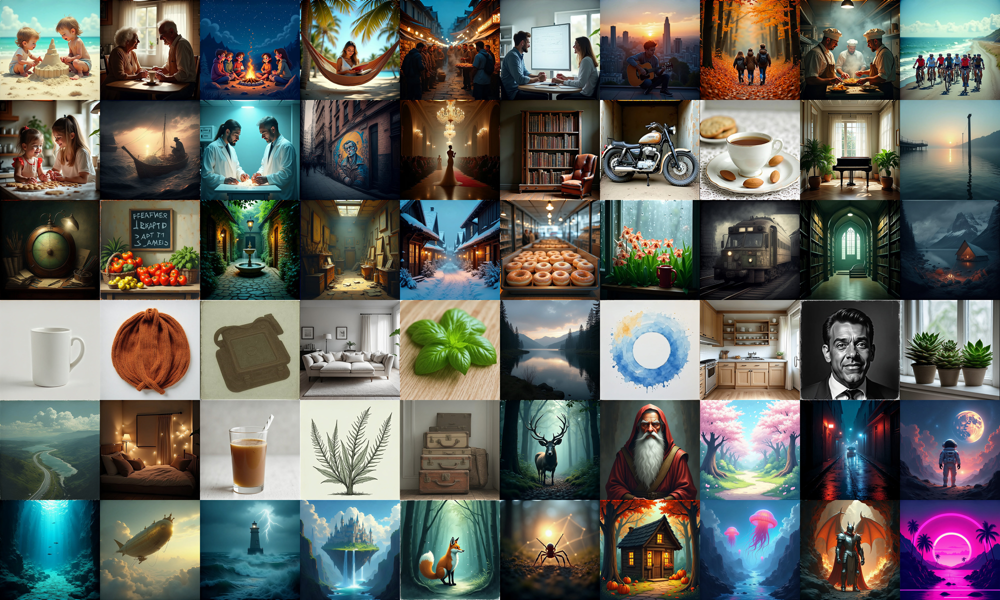
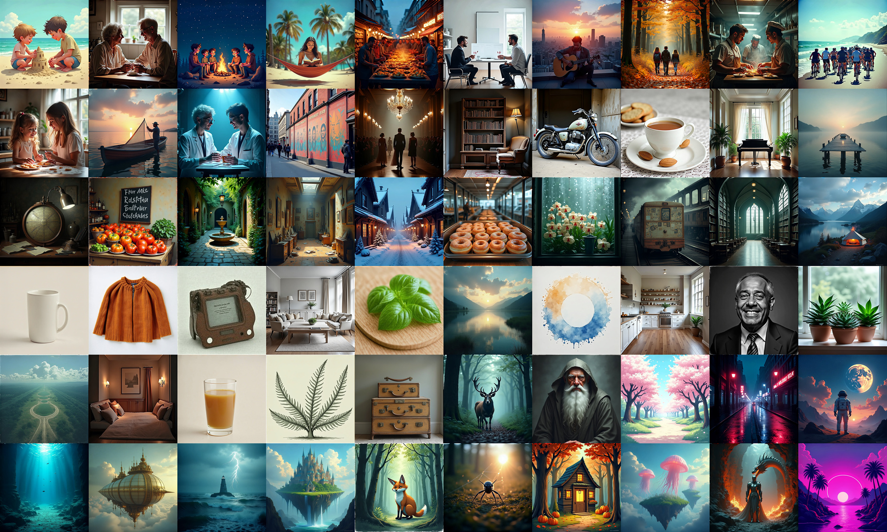
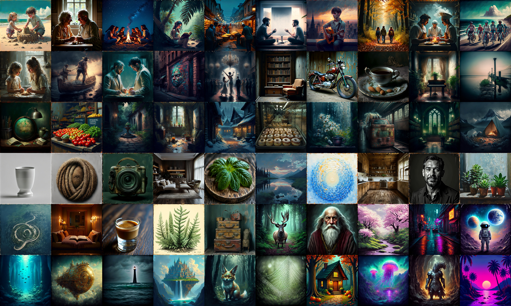
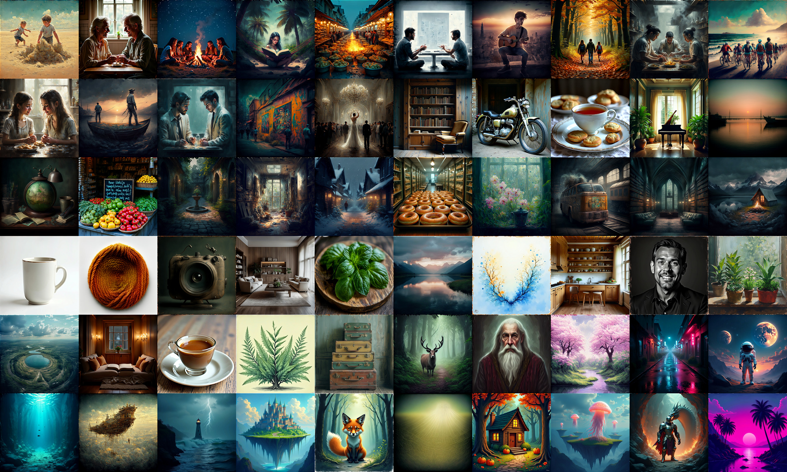
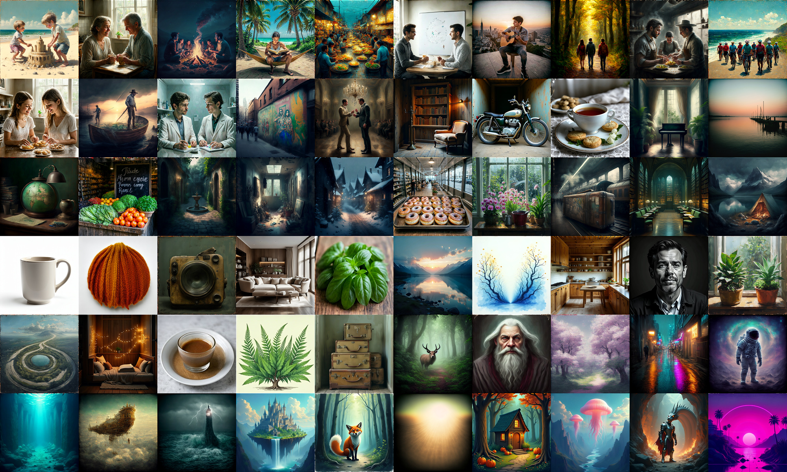
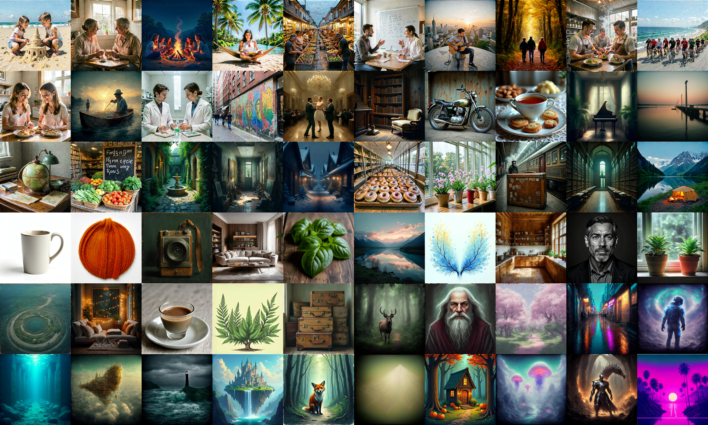

# PIERROT 1.6B (phase3) — step별 샘플 관찰 기록

작성일: 2026-07-09

이 문서는 PIERROT 1.6B 모델(phase3)이 학습 step에 따라 어떻게 변해 가는지를, 매번 똑같은 조건으로 뽑은 샘플 그리드로 기록한 것이다. 목적은 [0.8b.md](0.8b.md)와 같다. **"몇 step 짜리 체크포인트가 어떤 그림을 그리는가"를 눈으로 바로 비교하는 것.**

1.6B는 0.8B와 달리 두 가지 구조적 사건을 겪는다. 이 기록의 핵심 관전 포인트다.

- **깊이 성장(depth growth)**: 0.8B(레이어 16장)에서 출발해 레이어 33장으로 키운 뒤 이어서 학습한다. phase3의 step 0은 "막 깊어진 직후"라는 뜻이다.
- **텍스트 어댑터(text adapter) 도입**: step 330k 지점에서 텍스트 쪽에 작은 모듈(레이어 2장)이 추가된다. 추가 시점에는 항등(identity)으로 동작하도록 0으로 초기화되어 있어, 도입 순간에는 출력이 바뀌지 않는다.

숫자 지표는 없다. 눈으로 본 관찰만 담는다.

## 1. 어떻게 뽑았나 (재현 조건)

체크포인트만 바꾸고 나머지는 전부 동일하다. 0.8B 문서와도 완전히 같은 조건이라, 두 모델을 교차 비교해도 된다.

| 항목 | 값 |
| --- | --- |
| 프롬프트 | base prior 캡션 스타일을 흉내 낸 신규 60개 (0.8B와 동일) → **[baseprior_prompts.json](baseprior_prompts.json)** |
| 해상도 | 1024 × 1024 |
| 샘플링 step | 28 |
| guidance scale (CFG) | 4.0 |
| 난수 seed | 42 (프롬프트마다 고정) |
| chi_prompt | OFF |
| 가중치 | EMA 체크포인트 (`ema.pt`) |
| 그리드 배치 | 10열 × 6행, 타일 400px, 여백 없음 |

프롬프트 60개 전문과 생성 조건은 **[baseprior_prompts.json](baseprior_prompts.json)** 에 함께 들어 있다. 0.8B 문서와 같은 파일을 쓴다.

| 계열 (`style`) | id 범위 | 캡션 스타일 출처 | 설명 |
| --- | --- | --- | --- |
| `natural_scene` | 1–15 | flux_generated | 자연 서술형 다중 주체 장면 |
| `detailed_scene` | 16–30 | flux_reason | 디테일 풍부한 단일 장면 묘사 |
| `short_web_caption` | 31–45 | cc12m | 짧은 웹/제품 캡션 |
| `artistic_keywords` | 46–60 | diffusiondb | 아티스틱 키워드 나열형 |

그리드 타일은 `id` 오름차순으로 배치된다(왼쪽→오른쪽, 위→아래). 첫 줄 10칸이 id 1–10, 마지막 줄이 id 51–60이다.

텍스트 어댑터는 체크포인트 안에 `text_adapter.*` 키가 있으면 **자동으로 감지되어 켜진다.** 330k 이전 체크포인트에는 그 키가 없어 어댑터 없이 로드된다. 별도 설정이 필요 없다.

> 저장소에는 압축본(JPEG, 폭 2000px)만 올려 두었다. 원본 PNG(4000×2400)는 개별 60장에서 다시 조립할 수 있다.

## 2. 한눈에 보는 요약

1.6B의 궤적은 세 구간으로 나뉜다.

| 구간 | step | 무슨 일이 일어나는가 |
| --- | --- | --- |
| **붕괴와 급속 회복** | 5k → 50k | 깊이를 키운 직후 base가 무너졌다가 5만 step만에 대부분 되돌아온다 |
| **안정·정제** | 100k → 350k | 사실성이 자리 잡는다. 300k 부근이 가장 깨끗하다 |
| **회화풍 재발** | 400k → 625k | 유화 같은 스타일이 다시 전반을 덮는다 |

| step | 어댑터 | 한 줄 평 |
| --- | --- | --- |
| 5k | ✗ | 거의 모든 타일이 유화 — 깊이 성장 직후 붕괴 |
| 50k | ✗ | 사실성 대부분 회복. 회복 속도가 매우 빠르다 |
| 100k | ✗ | 사실성 유지, 탁한 회화 캐스트가 일부 재등장 |
| 150k | ✗ | 일러스트풍과 사진풍이 뒤섞임 |
| 200k | ✗ | 사진톤이 우세해지며 정돈 |
| 250k | ✗ | 깨끗한 사실톤 유지 |
| 300k | ✗ | **관찰 구간 중 가장 깨끗** |
| 350k | ✅ 도입 후 | 300k 수준 유지 — **어댑터가 품질을 깨지 않는다** |
| 400k | ✅ | 어둡고 따뜻한 유화 캐스트가 나타나기 시작 |
| 450k | ✅ | 회화풍 심화. 질감이 거칠고 명암이 과장됨 |
| 500k | ✅ | 유화풍이 전반을 덮음 |
| 550k | ✅ | 500k와 같은 경향 |
| 600k | ✅ | 시장·골목·지구본·가방까지 모두 회화 |
| 625k | ✅ | 600k와 동일 경향 (현재 최신) |

여기서 "회화풍(painterly)"은 사진을 요청했는데도 붓질 질감·과장된 명암·유화 같은 색층이 나오는 현상을 말한다.

## 3. 구간 1 — 붕괴와 급속 회복

### 3.1 step 5k — 깊이 성장 직후

- 60장 거의 전부가 **유화 또는 일러스트**로 나온다. 사진 요청도 통하지 않는다.
- 레이어를 16장에서 33장으로 늘린 직후라 기존에 학습된 표현이 흐트러진 상태다. 주제와 구도는 유지되지만 질감·색은 완전히 무너져 있다.

### 3.2 step 50k — 5만 step만의 회복

- 5k의 전면 유화 캐스트가 **대부분 사라진다.** 오토바이·찻잔·머그·소파·낙엽길·자전거가 다시 사실적 사진톤으로 돌아온다.
- 모닥불·요정성 같은 판타지 계열에만 일러스트 스타일이 남는다(이건 프롬프트가 그렇게 시킨 것이라 정상).
- **관전 포인트**: 깊이를 키운 충격이 불과 5만 step에 대부분 흡수된다. 깊이 성장 방식이 잘 작동하고 있다는 신호다.

## 4. 구간 2 — 안정과 정제

### 4.1 step 100k

- 사실성은 유지되지만, 지구본·시장·골목·기차에서 **탁한 회화 캐스트가 살짝 되돌아온다.** 5k만큼 심하지는 않다.

### 4.2 step 150k

- 일러스트풍(모래성·모닥불·자전거)과 사진풍(오토바이·머그·소파)이 **뒤섞인 과도기**다.

### 4.3 step 200k

- 사진톤이 우세해진다. 찻잔·오토바이·주방·인물 흑백 초상이 안정적이다.

### 4.4 step 250k

- 200k의 흐름을 이어 사실톤을 유지한다. 스타일 편향이 낮은 구간.

### 4.5 step 300k — 가장 깨끗한 지점

- 오토바이·찻잔·주방·소파가 모두 사진처럼 나온다. 색균형도 자연스럽다.
- **관찰한 모든 1.6B 체크포인트 중 스타일 편향이 가장 적다.**

### 4.6 step 350k — 텍스트 어댑터 도입 직후

- 어댑터가 들어간 뒤의 첫 관찰 지점이다(도입은 330k).
- **품질과 스타일이 300k와 사실상 같다.** 약간 부드러워진 정도이고, 무너진 곳이 없다.
- **이 비교가 중요한 이유**: "phase3 품질 저하가 어댑터를 끼워 넣은 탓 아니냐"는 의심이 있었는데, 도입 직전(300k)과 직후(350k)가 동등하므로 **그 가설은 성립하지 않는다.** 어댑터는 항등으로 초기화되어 들어오므로 이론과도 일치한다.

## 5. 구간 3 — 회화풍 재발

### 5.1 step 400k — 전환점

- 어둡고 따뜻한 유화 캐스트가 **뚜렷하게 나타나기 시작한다.** 시장·골목·기차·지구본이 회화로 기운다.
- 350k와 400k 사이가 전환 구간이다. 어댑터 도입(330k)보다 **뒤에 벌어진 일**이라는 점에 주의.

### 5.2 step 450k

- 회화풍이 더 짙어진다. 명암이 과장되고 질감이 거칠어진다. 흰 머그컵조차 회화적 음영을 얻는다.

### 5.3 step 500k

- 유화풍이 전반을 덮는다. 사진 프롬프트도 회화로 응답한다.

### 5.4 step 550k

- 500k와 같은 경향. 인물(마법사·재즈 연주자)은 완전히 회화 초상이 된다.

### 5.5 step 600k

- 시장·골목·지구본·낙엽길·여행가방까지 모두 유화톤. 회화풍이 base 전반에 자리 잡았다.

### 5.6 step 625k — 현재 최신

- 600k와 같은 경향이 유지된다. 인물 피부와 조명 표현은 정돈되어 있으나, 스타일 편향은 남아 있다.

## 6. 이 기록에서 읽어야 할 것

- **깊이 성장은 회복 가능하다.** 5k에서 무너진 base가 50k에서 대부분 돌아왔다. 깊이를 키운 직후의 샘플만 보고 실패로 판단하면 안 된다.
- **텍스트 어댑터는 품질을 깨지 않았다.** 300k(직전)와 350k(직후)가 동등하다. 이후의 회화풍 재발은 어댑터와 시점이 다르다(전환은 350k→400k).
- **회화풍 편향은 0.8B에서 본 것과 같은 모양으로 되풀이된다.** 0.8B는 1.0M(깨끗) → 2.0M(회화)로 갔고, 1.6B는 300k(깨끗) → 600k(회화)로 갔다. 모델 크기가 달라도 같은 곡선을 그린다는 것은, 원인이 구조가 아니라 **학습 데이터 분포 쪽**에 있음을 강하게 시사한다.
- **손실 곡선으로는 이 변화를 알 수 없다.** 중간 체크포인트를 주기적으로 뽑아 눈으로 보는 수밖에 없다.

## 7. 관련 문서

- [0.8b.md](0.8b.md) — 0.8B(phase2 base) 모델의 같은 형식 기록
- [SFT.md](SFT.md) — phase2 base 이후 SFT 실험 일기
