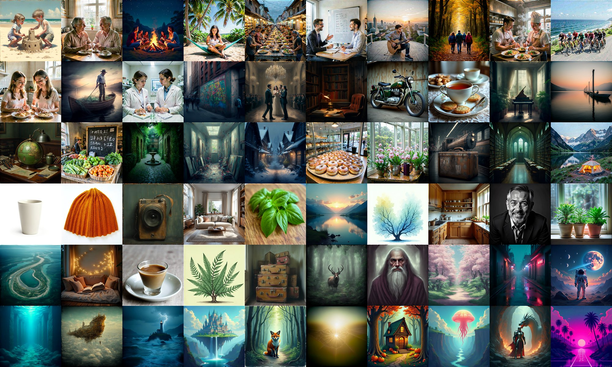
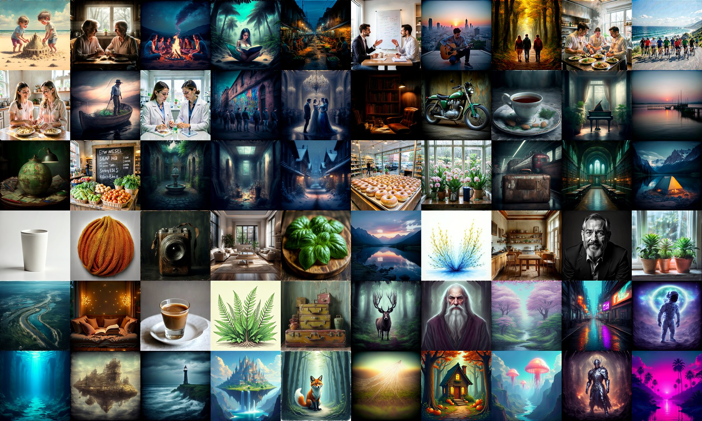
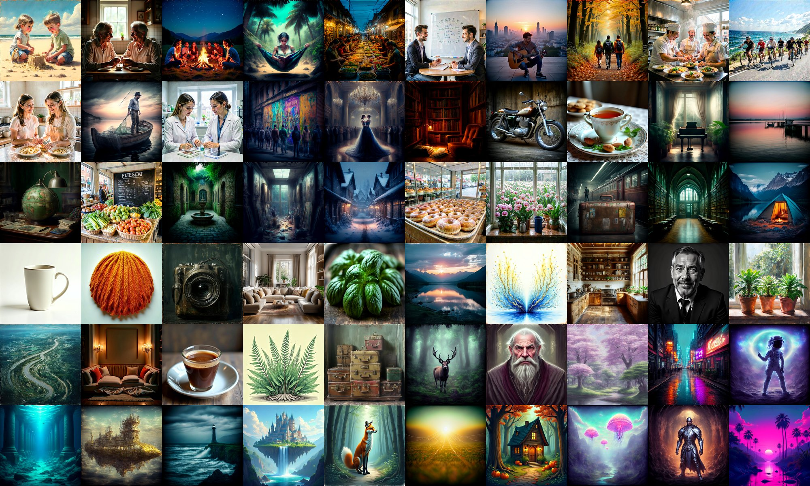
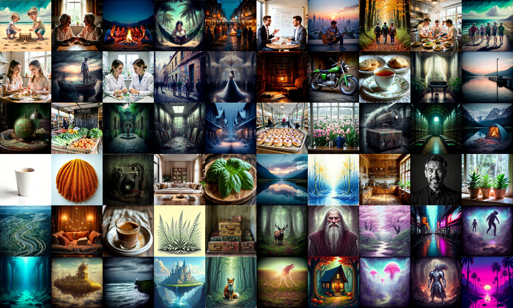
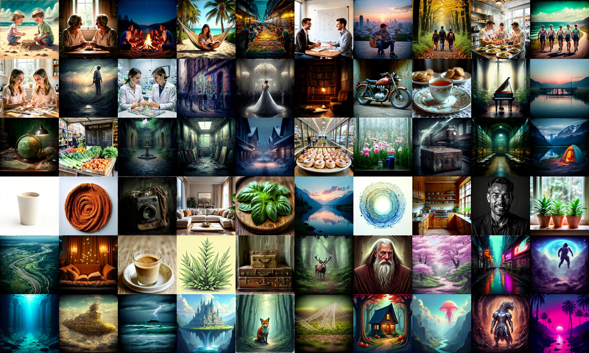
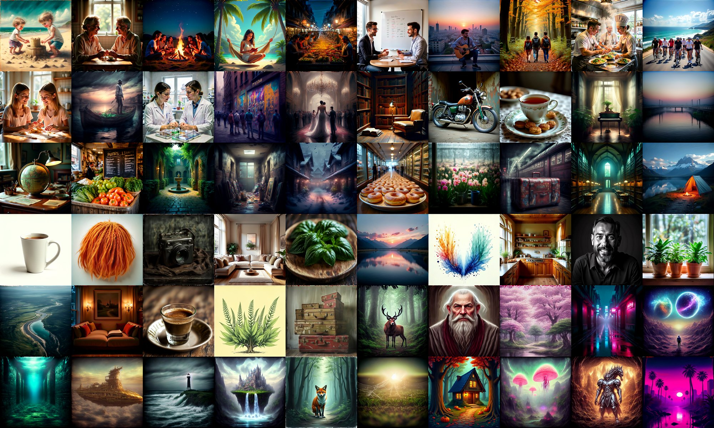
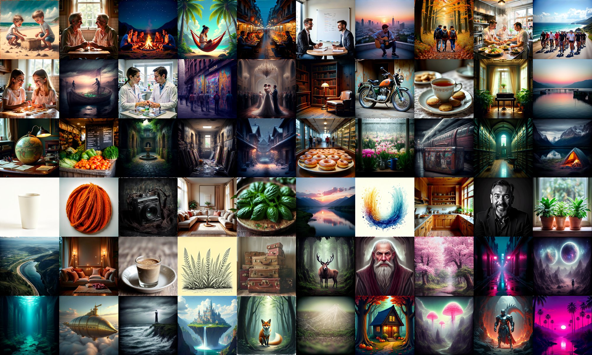
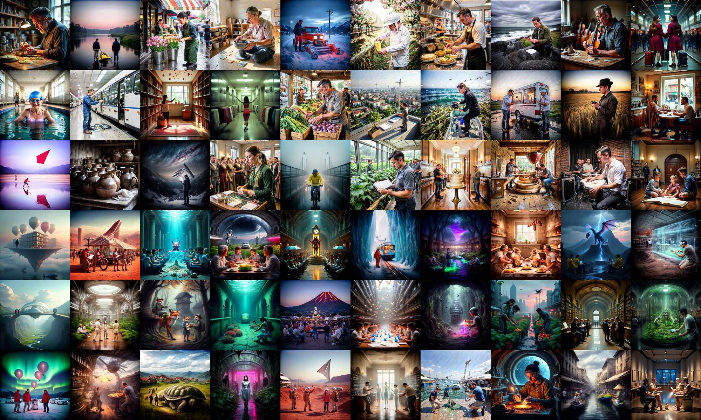
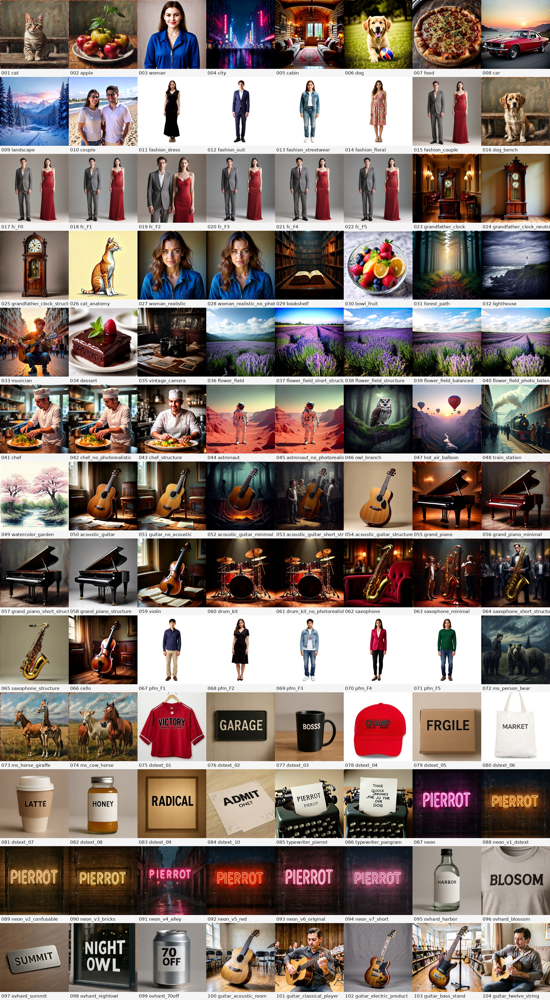

# PIERROT 1.6B (phase3) — step별 샘플 관찰 기록

작성일: 2026-07-20

이 문서는 PIERROT 1.6B 모델(phase3)이 학습 step에 따라 어떻게 변해 가는지를, 매번 똑같은 조건으로 뽑은 샘플 그리드로 기록한 것이다. 목적은 [0.8b_training_review.md](0.8b_training_review.md)와 같다. **"몇 step 짜리 체크포인트가 어떤 그림을 그리는가"를 눈으로 바로 비교하는 것.**

1.6B는 0.8B와 달리 두 가지 구조적 사건을 겪는다. 이 기록의 핵심 관전 포인트다.

- **깊이 성장(depth growth)**: 0.8B(레이어 16장)에서 출발해 레이어 33장으로 키운 뒤 이어서 학습한다. phase3의 step 0은 "막 깊어진 직후"라는 뜻이다.
- **텍스트 어댑터(text adapter) 도입**: step 330k 지점에서 텍스트 쪽에 작은 모듈(레이어 2장)이 추가된다. 추가 시점에는 항등(identity)으로 동작하도록 0으로 초기화되어 있어, 도입 순간에는 출력이 바뀌지 않는다.

숫자 지표는 없다. 눈으로 본 관찰만 담는다.

## 1. 어떻게 뽑았나 (재현 조건)

체크포인트만 바꾸고 나머지는 전부 동일하다. 0.8B 문서와도 완전히 같은 조건이라, 두 모델을 교차 비교해도 된다.

| 항목 | 값 |
| --- | --- |
| 프롬프트 | base prior 캡션 스타일을 흉내 낸 신규 60개 (0.8B와 동일) → **[baseprior_prompts.json](../baseprior_prompts.json)** |
| 해상도 | 1024 × 1024 |
| 샘플링 step | 28 |
| guidance scale (CFG) | 4.0 |
| 난수 seed | 42 (프롬프트마다 고정) |
| chi_prompt | OFF |
| 가중치 | EMA 체크포인트 (`ema.pt`) |
| 그리드 배치 | 10열 × 6행, 타일 400px, 여백 없음 |

프롬프트 60개 전문과 생성 조건은 **[baseprior_prompts.json](../baseprior_prompts.json)** 에 함께 들어 있다. 0.8B 문서와 같은 파일을 쓴다.

| 계열 (`style`) | id 범위 | 캡션 스타일 출처 | 설명 |
| --- | --- | --- | --- |
| `natural_scene` | 1–15 | flux_generated | 자연 서술형 다중 주체 장면 |
| `detailed_scene` | 16–30 | flux_reason | 디테일 풍부한 단일 장면 묘사 |
| `short_web_caption` | 31–45 | cc12m | 짧은 웹/제품 캡션 |
| `artistic_keywords` | 46–60 | diffusiondb | 아티스틱 키워드 나열형 |

그리드 타일은 `id` 오름차순으로 배치된다(왼쪽→오른쪽, 위→아래). 첫 줄 10칸이 id 1–10, 마지막 줄이 id 51–60이다.

텍스트 어댑터는 체크포인트 안에 `text_adapter.*` 키가 있으면 **자동으로 감지되어 켜진다.** 330k 이전 체크포인트에는 그 키가 없어 어댑터 없이 로드된다. 별도 설정이 필요 없다.

> 저장소에는 압축본(JPEG, 폭 2000px)만 올려 두었다. 원본 PNG(4000×2400)는 개별 60장에서 다시 조립할 수 있다.

## 2. 한눈에 보는 요약

1.6B의 궤적은 네 구간으로 나뉜다.

| 구간 | step | 무슨 일이 일어나는가 |
| --- | --- | --- |
| **붕괴와 급속 회복** | 5k → 50k | 깊이를 키운 직후 base가 무너졌다가 5만 step만에 대부분 되돌아온다 |
| **안정·정제** | 100k → 350k | 사실성이 자리 잡는다. 300k 부근이 가장 깨끗하다 |
| **회화풍 재발** | 400k → 625k | 유화 같은 스타일이 다시 전반을 덮는다 |
| **안정적 plateau** | 655k → 930k | 큰 붕괴·회복 없이 구조와 사실성을 유지하고 색조만 미세하게 흔들린다 |

| step | 어댑터 | 한 줄 평 |
| --- | --- | --- |
| 5k | ✗ | 거의 모든 타일이 유화 — 깊이 성장 직후 붕괴 |
| 50k | ✗ | 사실성 대부분 회복. 회복 속도가 매우 빠르다 |
| 100k | ✗ | 사실성 유지, 탁한 회화 캐스트가 일부 재등장 |
| 150k | ✗ | 일러스트풍과 사진풍이 뒤섞임 |
| 200k | ✗ | 사진톤이 우세해지며 정돈 |
| 250k | ✗ | 깨끗한 사실톤 유지 |
| 300k | ✗ | **관찰 구간 중 가장 깨끗** |
| 350k | ✅ 도입 후 | 300k 수준 유지 — **어댑터가 품질을 깨지 않는다** |
| 400k | ✅ | 어둡고 따뜻한 유화 캐스트가 나타나기 시작 |
| 450k | ✅ | 회화풍 심화. 질감이 거칠고 명암이 과장됨 |
| 500k | ✅ | 유화풍이 전반을 덮음 |
| 550k | ✅ | 500k와 같은 경향 |
| 600k | ✅ | 시장·골목·지구본·가방까지 모두 회화 |
| 625k | ✅ | 600k와 동일 경향 (후속 관찰의 기준점) |
| 655k | ✅ | 625k와 연속적. 구조와 구도 유지 |
| 680k | ✅ | 큰 변화 없이 안정 |
| 705k | ✅ | 어두운 청록 캐스트가 약간 강해짐 |
| 730k | ✅ | 차가운 그림자와 높은 대비가 두드러짐 |
| 755k | ✅ | 730k 경향을 유지하며 형태가 안정적 |
| 780k | ✅ | 사진 계열의 선명도와 대비가 소폭 개선 |
| 805k | ✅ | 자연·상세 장면의 구조가 안정적으로 유지됨 |
| 830k | ✅ | 일부 짧은 프롬프트의 스타일 변동 외에는 안정 |
| 855k | ✅ | 따뜻하고 어두운 캐스트가 소폭 되돌아옴 |
| 880k | ✅ | 색균형이 다시 중립 쪽으로 이동 |
| 905k | ✅ | 어두운 실내·야간 장면의 대비가 강해짐 |
| 930k | ✅ | 905k와 같은 안정 구간. 104-prompt 진단에서도 기본 구조·다중 주체·짧은 텍스트가 안정적 |

여기서 "회화풍(painterly)"은 사진을 요청했는데도 붓질 질감·과장된 명암·유화 같은 색층이 나오는 현상을 말한다.

## 3. 구간 1 — 붕괴와 급속 회복

### 3.0 왜 처음부터 어느 정도는 그려지는가 — 0.8B에서 물려받았기 때문

phase3의 5k 체크포인트는 질감과 색이 무너져 있지만, **주제와 구도는 이미 정확히 맞춘다.** 무작위로 초기화한(from scratch) 1.6B 모델이라면 5k step에서는 형체조차 나오지 않는다. 그런데 여기서는 "그림은 그리는데 화풍이 이상한" 상태다. 이 차이는 학습을 **0부터 시작하지 않았기 때문**이다.

phase3는 이미 수백만 step을 학습해 충분히 수렴한 0.8B 모델(레이어 16장)의 가중치를 물려받아, 레이어를 33장으로 늘린 뒤 이어서 학습한 것이다. 즉 **작은 모델이 쌓아 둔 지식을 큰 모델의 출발점으로 재사용**한다. 이 방식을 모델 성장(model growth) 또는 깊이 성장(depth growth)이라 부른다.

이는 **SANA 1.5**가 제안한 효율적 모델 성장(efficient model growth)과 같은 발상이다. 큰 모델을 처음부터 학습하는 대신, 이미 수렴한 작은 모델을 초기값으로 삼아 학습 비용을 크게 줄이는 접근이다. PIERROT처럼 GPU 예산이 빠듯한 환경에서는 사실상 유일하게 현실적인 확장 경로다.

- 리뷰: [SANA 1.5 — Efficient Scaling of Training-Time and Inference-Time Compute in Linear Diffusion Transformer](https://github.com/Pierrot-vision/Reading-Papers/blob/main/Diffusion/PAPER_SANA-1.5.md)
- 참고: [SANA — Efficient High-Resolution Image Synthesis with Linear Diffusion Transformers](https://github.com/Pierrot-vision/Reading-Papers/blob/main/Diffusion/PAPER_Sana.md)

그래서 아래 5k → 50k에서 보이는 "붕괴 후 급속 회복"은 이렇게 읽어야 한다. **붕괴한 것은 지식 전체가 아니라 표현의 배치다.** 레이어를 끼워 넣으면서 잔차(residual) 경로의 균형이 흐트러져 질감·색이 일시적으로 깨지지만, 무엇을 그릴지에 대한 지식은 0.8B에서 그대로 살아 있다. 그래서 5만 step이라는 짧은 구간에 대부분 제자리를 찾는다.

### 3.1 step 5k — 깊이 성장 직후

- 60장 거의 전부가 **유화 또는 일러스트**로 나온다. 사진 요청도 통하지 않는다.
- 레이어를 16장에서 33장으로 늘린 직후라 기존에 학습된 표현이 흐트러진 상태다. 주제와 구도는 유지되지만 질감·색은 완전히 무너져 있다.

### 3.2 step 50k — 5만 step만의 회복

- 5k의 전면 유화 캐스트가 **대부분 사라진다.** 오토바이·찻잔·머그·소파·낙엽길·자전거가 다시 사실적 사진톤으로 돌아온다.
- 모닥불·요정성 같은 판타지 계열에만 일러스트 스타일이 남는다(이건 프롬프트가 그렇게 시킨 것이라 정상).
- **관전 포인트**: 깊이를 키운 충격이 불과 5만 step에 대부분 흡수된다. 깊이 성장 방식이 잘 작동하고 있다는 신호다.

## 4. 구간 2 — 안정과 정제

### 4.1 step 100k

- 사실성은 유지되지만, 지구본·시장·골목·기차에서 **탁한 회화 캐스트가 살짝 되돌아온다.** 5k만큼 심하지는 않다.

### 4.2 step 150k

- 일러스트풍(모래성·모닥불·자전거)과 사진풍(오토바이·머그·소파)이 **뒤섞인 과도기**다.

### 4.3 step 200k

- 사진톤이 우세해진다. 찻잔·오토바이·주방·인물 흑백 초상이 안정적이다.

### 4.4 step 250k

- 200k의 흐름을 이어 사실톤을 유지한다. 스타일 편향이 낮은 구간.

### 4.5 step 300k — 가장 깨끗한 지점

- 오토바이·찻잔·주방·소파가 모두 사진처럼 나온다. 색균형도 자연스럽다.
- **관찰한 모든 1.6B 체크포인트 중 스타일 편향이 가장 적다.**

### 4.6 step 350k — 텍스트 어댑터 도입 직후

- 어댑터가 들어간 뒤의 첫 관찰 지점이다(도입은 330k).
- **품질과 스타일이 300k와 사실상 같다.** 약간 부드러워진 정도이고, 무너진 곳이 없다.
- **이 비교가 중요한 이유**: "phase3 품질 저하가 어댑터를 끼워 넣은 탓 아니냐"는 의심이 있었는데, 도입 직전(300k)과 직후(350k)가 동등하므로 **그 가설은 성립하지 않는다.** 어댑터는 항등으로 초기화되어 들어오므로 이론과도 일치한다.

## 5. 구간 3 — 회화풍 재발

### 5.1 step 400k — 전환점

- 어둡고 따뜻한 유화 캐스트가 **뚜렷하게 나타나기 시작한다.** 시장·골목·기차·지구본이 회화로 기운다.
- 350k와 400k 사이가 전환 구간이다. 어댑터 도입(330k)보다 **뒤에 벌어진 일**이라는 점에 주의.

### 5.2 step 450k

- 회화풍이 더 짙어진다. 명암이 과장되고 질감이 거칠어진다. 흰 머그컵조차 회화적 음영을 얻는다.

### 5.3 step 500k

- 유화풍이 전반을 덮는다. 사진 프롬프트도 회화로 응답한다.

### 5.4 step 550k

- 500k와 같은 경향. 인물(마법사·재즈 연주자)은 완전히 회화 초상이 된다.

### 5.5 step 600k

- 시장·골목·지구본·낙엽길·여행가방까지 모두 유화톤. 회화풍이 base 전반에 자리 잡았다.

### 5.6 step 625k — 후속 관찰의 기준점

- 600k와 같은 경향이 유지된다. 인물 피부와 조명 표현은 정돈되어 있으나, 스타일 편향은 남아 있다.

### 5.7 step 655k

- 625k와 거의 연속적인 출력이다. 인물·제품·실내 장면의 구조는 유지되며 어두운 웜톤과 청록 그림자가 함께 남아 있다.

### 5.8 step 680k

- 655k 대비 전역적인 품질 변화는 보이지 않는다. 사진 계열과 아트 계열의 분리가 유지되는 안정 구간이다.

### 5.9 step 705k

- 실내·야간 장면에서 어두운 청록 캐스트가 조금 강해진다. 형태 붕괴나 프롬프트 이탈은 관찰되지 않는다.

### 5.10 step 730k

- 차가운 그림자와 높은 대비가 두드러진다. 판타지·키워드 계열의 채도도 함께 강해지지만 자연 장면의 구도는 안정적이다.

### 5.11 step 755k

- 730k의 색조를 이어가며 오토바이·찻잔·온실·제품 사진의 형태와 재질 표현이 안정적으로 유지된다.

### 5.12 step 780k

- 사진 계열 타일의 선명도와 대비가 소폭 좋아진다. 다만 어두운 장면의 청록 그림자는 계속 남아 있다.

### 5.13 step 805k

- 자연 서술형과 상세 장면에서 인물 배치와 사물 구조가 안정적이다. 780k에서 큰 방향 전환 없이 정제되는 모습이다.

### 5.14 step 830k

- 짧은 캡션과 아트 키워드 일부에서 질감·구도가 바뀌지만, 그리드 전체의 사실성이나 색조가 무너지는 변화는 없다.

### 5.15 step 855k

- 830k보다 따뜻하고 어두운 캐스트가 소폭 강해진다. 사진 계열의 형태 품질은 그대로 유지된다.

### 5.16 step 880k

- 855k의 웜톤이 완화되어 색균형이 다시 중립 쪽으로 이동한다. 인물·제품·풍경 모두 안정적이다.

### 5.17 step 905k

- 어두운 실내와 야간 장면의 대비가 다시 강해진다. 밝은 제품 사진과 자연 장면은 깨끗한 구조를 유지한다.

### 5.18 step 930k — 현재 최신

- 905k와 같은 안정 구간이다. 625k 이후 전체를 놓고 보면 급격한 붕괴나 회복 없이, 색조와 개별 구도만 완만하게 흔들린다.

## 6. 이 기록에서 읽어야 할 것

- **깊이 성장은 회복 가능하다.** 5k에서 무너진 base가 50k에서 대부분 돌아왔다. 깊이를 키운 직후의 샘플만 보고 실패로 판단하면 안 된다.
- **텍스트 어댑터는 품질을 깨지 않았다.** 300k(직전)와 350k(직후)가 동등하다. 이후의 회화풍 재발은 어댑터와 시점이 다르다(전환은 350k→400k).
- **회화풍 편향은 0.8B에서 본 것과 같은 모양으로 되풀이된다.** 0.8B는 1.0M(깨끗) → 2.0M(회화)로 갔고, 1.6B는 300k(깨끗) → 600k(회화)로 갔다. 모델 크기가 달라도 같은 곡선을 그린다는 것은, 원인이 구조가 아니라 **학습 데이터 분포 쪽**에 있음을 강하게 시사한다.
- **625k 이후 930k까지는 안정 구간이다.** 25k 간격으로 본 12개 그리드에서 이전과 같은 대규모 스타일 전환은 없었다. 어두운 웜톤·청록 그림자의 강도는 오르내리지만, 사실성과 프롬프트 정합성은 유지된다.
- **손실 곡선으로는 이 변화를 알 수 없다.** 중간 체크포인트를 주기적으로 뽑아 눈으로 보는 수밖에 없다.

## 7. fine_t2i 분포 유사 프롬프트 — 최신 930k 평가

base prior 고정 프롬프트와 별도로, 실제 학습 데이터인 `fine_t2i`의 캡션 길이와 서술 방식을 참고하되 **원문을 복사하지 않고 새로 작성한 60개 프롬프트**로 최신 phase3 체크포인트를 확인했다. 프롬프트 전문과 조건은 [fine_t2i_prompts.json](../fine_t2i_prompts.json)에 기록했다.

- `curated_like` 30개(id 1–30): 눈에 보이는 사람·직업·장소·행동을 25–80단어로 묘사한 비교적 짧은 실사형 문장
- `synthetic_like` 30개(id 31–60): 전경·중경·배경, 재질, 조명, 개체 관계를 120–200단어로 지정한 장문 합성형 문장
- `fine_t2i` 전체 1,784,016개 캡션을 정규화해 대조한 결과, 신규 프롬프트와 **완전히 같은 문장은 0개**였다.
- 생성 조건은 1024×1024, 28 step, CFG 4.0, seed 42, chi_prompt OFF, phase3 step 930k EMA로 위의 base prior 평가와 동일하다.

### 관찰

- **짧은 실사형은 직업·장소·주요 행동을 대부분 안정적으로 잡는다.** 시계 수리공, 제설차, 수영장, 전기버스, 세탁소의 무용수, 도예 작업장처럼 서로 다른 장면에서도 인물과 공간의 기본 구조 및 재질이 자연스럽다.
- **세부 개체 누락은 남아 있다.** id 19는 밀밭과 인물은 만들었지만 핵심인 장갑 위 매가 빠지고 인물 성별도 바뀌었다. 손과 작은 도구는 그리드 수준에서는 대체로 자연스럽지만, 정확한 개수·속성 보존은 별도 확대 평가가 필요하다.
- **장문 합성형은 핵심 콘셉트와 분위기에는 강하다.** id 38의 벽 속 생쥐 제빵소, id 39의 번개를 만드는 드래곤 관측소, id 56의 유령과 함께하는 호텔 복원은 한눈에 의도를 읽을 수 있고, 조명·공간 깊이·재질도 일관적이다.
- **그러나 긴 문장의 모든 관계를 끝까지 유지하지는 못한다.** id 49는 네 시대를 보여 주는 네 개의 포털이 일반 도서관 군중 장면으로 축약됐다. 여러 인물·사물·공간 관계가 동시에 요구될수록 중심 소재만 남고 주변 조건이 생략되는 경향이 보인다.
- 전체적으로 930k는 `fine_t2i`와 유사한 실사 및 복합 서술 분포에서도 **형태 붕괴 없이 높은 장면 완성도**를 유지하지만, 다음 개선 지점은 장문에서의 개체 수, 속성, 공간 관계 충실도다.

## 8. 104-prompt 진단 배터리 — 최신 완전 EMA 930k 평가

앞의 두 평가는 학습 궤적과 `fine_t2i` 분포 정합을 보는 60개 고정 프롬프트다. 여기에 서로 다른 실패 양상을 한 번에 드러내기 위한 **104개 진단 배터리**를 추가로 실행했다. 기본 사물·인물·풍경뿐 아니라 패션 다중 주체, 시계·악기 구조, 짧은 상품 문구, typewriter 장문, neon 및 난도 높은 텍스트 렌더링을 포함한다.

| 항목 | 값 |
| --- | --- |
| 체크포인트 | `PIERROT/checkpoints/phase3/step_00930000/ema.pt` |
| 모델 | 1.6B (`config-size=1.6b`, 실제 1.695B parameters) |
| 프롬프트 | `PIERROT/infer.sh`의 고정 진단 배터리 104개 |
| 생성 조건 | 1024×1024, 28 step, CFG 4.0, seed 42, chi_prompt OFF |
| 실행 경로 | `infer_fast.sh`와 같은 배치 경로 (`sample_batch.py`); 저장 경로 재지정으로 13개 + 91개 두 배치로 재개했고 각 배치에서 모델을 1회 로드 |
| 결과 | `PIERROT/results/phase3/pierrot_step_00930000_ema_<tag>_20260719.png` |
| 완결성 검증 | job 104줄과 104개 PNG를 일대일 대조, 0바이트 파일 0개, 총 121MB |

아래 그리드는 job 순서를 유지한 8열×13행 배치다. 각 타일 아래의 번호와 tag로 원본 PNG를 바로 찾을 수 있다.

### 관찰

- **기본 생성 품질은 안정적이다.** cat·apple·woman·city·cabin·dog·food·car·landscape가 모두 프롬프트의 핵심 대상과 장면을 즉시 알아볼 수 있게 만든다. 60개 base-prior 그리드에서 본 930k의 안정 구간 판정과 일치한다.
- **패션 다중 주체 binding이 강하다.** `fc_F0`–`fc_F5`는 표현을 조금씩 바꿔도 회색 정장의 남성과 빨간 드레스의 여성을 나란히 유지한다. 단일 인물 패션 프롬프트도 의상 종류와 전신 구도를 안정적으로 보존한다.
- **서로 다른 동물 두 종도 분리된다.** horse+giraffe와 cow+horse가 한 장면에 각각의 형태로 나타난다. 단순한 두 주체 조합에서는 한 대상을 다른 대상으로 합치거나 누락하는 문제가 크지 않다.
- **시계와 악기의 큰 구조는 일관적이다.** grandfather clock의 긴 케이스·원형 문자판·진자, grand piano의 곡면 몸체·건반·뚜껑, saxophone의 벨·키·마우스피스가 프롬프트 변형 사이에서도 유지된다. acoustic/classical/electric/bass guitar도 서로 다른 실루엣과 사용 장면을 구분한다.
- **세밀한 해부·부품 수까지 보장되지는 않는다.** cat anatomy는 고양이의 측면 도해 스타일은 잡지만 과학 라벨 도표로 완성되지 않는다. twelve-string guitar는 기타와 연주 자세는 자연스럽지만 12현의 paired strings를 눈으로 확정하기 어렵다. 즉 개체 범주와 큰 구조는 강하지만 작은 부품의 정확한 개수는 아직 별도 확대 검증 대상이다.
- **짧고 고립된 텍스트는 대체로 강하다.** `VICTORY`, `GARAGE`, `CHAMP`, `MARKET`, `LATTE`, `HONEY`, `RADICAL`, `ADMIT ONE`, `HARBOR`, `SUMMIT`, `NIGHT OWL`, `70 OFF`가 읽을 수 있는 형태로 나온다. neon 계열의 `PIERROT`도 색·배경·구도를 바꾼 여러 변형에서 안정적으로 유지된다.
- **정확 철자와 긴 문장에서는 명확한 실패가 남는다.** `BOSS→BOSSS`, `FRAGILE→FRGILE`, `BLOSSOM→BLOSOM`처럼 한 글자가 삽입·누락된다. typewriter의 pangram은 여러 단어가 훼손되고, 단일 `PIERROT` 요청에도 작은 중복 텍스트가 붙는다. 텍스트 능력은 “짧은 단어를 읽을 수 있게 그리기” 단계는 넘었지만, 긴 문자열의 문자 단위 exact match에는 이르지 못했다.

### 판정

104-prompt 배터리는 기존 결론을 뒤집지 않는다. **930k는 형태 붕괴 없이 기본 장면, 패션 다중 주체, 대표적인 사물·악기 구조를 안정적으로 생성한다.** 동시에 다음 개선 목표를 더 구체적으로 좁힌다. 우선순위는 (1) 긴 텍스트의 철자 보존, (2) 12현·해부 라벨처럼 작은 부품의 개수와 배치, (3) 복잡한 장문 관계의 완전한 유지다.

## 9. 관련 문서

- [0.8b_training_review.md](0.8b_training_review.md) — 0.8B(phase2 base) 모델의 같은 형식 기록
- [SFT.md](SFT.md) — phase2 base 이후 SFT 실험 일기
