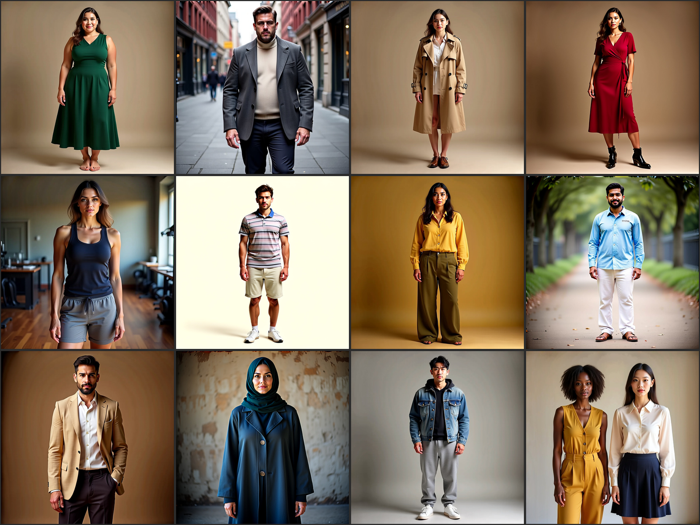
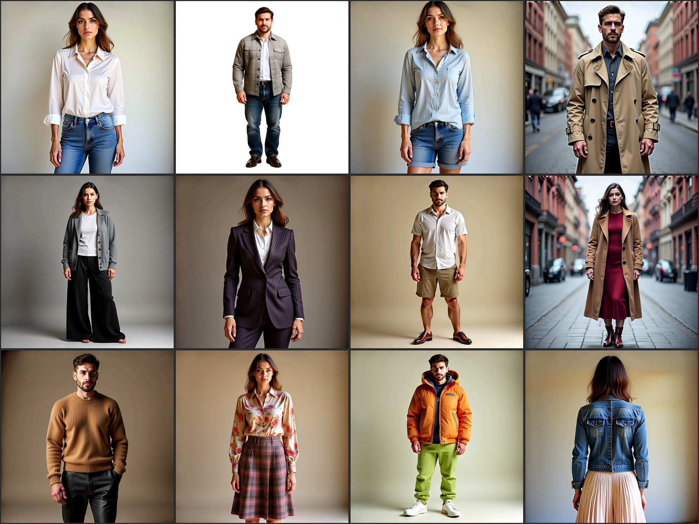

# 인물 학습셋의 빈 구멍 — 커버리지 프로브

작성일: 2026-07-20

PIERROT의 전신 인물 학습셋(`person_full_model`, 177,357장)이 **무엇을 담고 있고 무엇을 담고 있지 않은지**를 캡션 통계로 확인한 뒤, **담고 있지 않은 것만 골라** 프롬프트를 만들어 1.6B 모델에 물어본 기록이다.

목적은 품질 자랑이 아니라 진단이다. 학습셋에 없는 조건을 요구했을 때 모델이 **일반화해서 그려내는지, 아니면 학습셋 분포로 되돌아가는지**를 보고, 2라운드 데이터 설계의 근거로 삼는다.

## 1. 학습셋에 무엇이 들어 있나

캡션 6만 건(18개 parquet 중 6개)을 어휘 단위로 세었다. 캡션은 평균 324자이며, 다음과 같은 고정된 틀을 따른다.

> `a slim white woman with short wavy hair is wearing a slim light-gray rib-knit plain long sleeve top with hip-length and a turtle neckline, regular long light-gray cotton-linen stripe trousers with a wide silhouette, black leather sandal with a open-toe ...`

체형 → 인종 → 머리 → 상의(핏·색·소재·패턴·기장·넥라인) → 하의 → 신발 → 액세서리 순서가 거의 그대로 반복된다. **표현이 다양한 것이 아니라 슬롯만 바뀌는 구조**다.

### 1.1 체형

| 표현 | 비율 |
| --- | --- |
| slim | 65.0% |
| average-sized | 43.3% |
| muscular | 4.0% |
| **plus-size / curvy / petite / athletic / chubby / overweight** | **0%** |

마른 체형과 보통 체형이 사실상 전부다. **큰 체형, 굴곡 있는 체형, 아주 작은 체형은 한 건도 없다.**

### 1.2 인종

| 표현 | 비율 |
| --- | --- |
| white | 73.4% |
| black | 67.8% |
| hispanic / latino | 13.5% |
| asian | 12.2% |
| **south asian / indian / middle-eastern** | **0%** |

백인과 흑인이 대부분이고, **남아시아·중동은 완전히 비어 있다.** 아시아도 12%로 낮다.

### 1.3 착장 스타일 (tuck / fold)

| 표현 | 비율 |
| --- | --- |
| untucked | 63.0% |
| open | 22.8% |
| tucked | 16.1% |
| rolled | 7.4% |
| layered | 0.01% |
| **half-tucked / folded / cuffed** | **0%** |

넣거나(tucked) 빼거나(untucked) 둘 중 하나뿐이다. **앞만 넣기(half-tuck), 소매·밑단 접기(cuff), 깃 세우기(fold)** 같은 중간 상태는 없다.

### 1.4 의류 종류

| 표현 | 비율 |
| --- | --- |
| shirt | 50.0% |
| t-shirt | 34.9% |
| jeans | 28.6% |
| pants / trousers | 27% |
| jacket | 8.9% |
| dress | 8.4% |
| coat | 1.2% |
| suit | 0.2% |
| **shorts** | **0.005% (3건)** |

셔츠와 청바지 중심의 캐주얼 정장 조합에 몰려 있다. **반바지는 6만 건 중 3건**, 정장은 0.2%다.

## 2. 어떻게 물어봤나

위에서 확인한 **0%이거나 극히 희소한 축만 골라** 24개 프롬프트를 만들었다. 전문은 [pfm_probe_prompts.json](../pfm_probe_prompts.json)에 있다.

문장 형식도 학습 캡션의 틀과 **일부러 다르게** 썼다. 같은 틀로 물으면 슬롯만 채워 넣는 암기인지 실제 이해인지 구분되지 않기 때문이다.

| 항목 | 값 |
| --- | --- |
| 모델 | PIERROT 1.6B — phase3 step **935k** (EMA) |
| 해상도 / step / CFG | 1024 × 1024 / 28 / 4.0 |
| seed | 42 (프롬프트마다 고정) |
| chi_prompt | OFF |

프롬프트 배치는 다음과 같다.

| 축 | id | 겨냥한 공백 |
| --- | --- | --- |
| 체형 | 1–6 | plus-size · petite · curvy · athletic (전부 0%) |
| 인종 | 7–12 | 남아시아 · 중동 (0%), 동아시아 (12%), 다인종 조합 |
| tuck / fold | 13–17 | half-tuck · cuff · collar fold · 3겹 레이어 (0%) |
| 의류 | 18–20 | suit (0.2%) · shorts (0.005%) · coat (1.2%) |
| 속성 | 21–24 | 소재 대비 · 패턴 혼합 · 색 블로킹 · 뒷모습 |

## 3. 결과

### 3.1 체형 · 인종 (id 1–12)

### 3.2 착장 스타일 · 의류 · 속성 (id 13–24)

## 4. 관찰

| 축 | 결과 | 내용 |
| --- | --- | --- |
| 인종 (id 7–12) | ✅ | 남아시아·중동·히잡·다인종 2인 모두 요청대로. 학습셋에 해당 단어가 0건인데도 나왔다 |
| 의류 (id 18–20) | ✅ | 정장·반바지·롱코트 모두 형태 정확. 핀스트라이프 더블 브레스트는 라펠·단추까지 맞다 |
| 속성 조합 (id 21–24) | ✅ | 소재 대비·패턴 혼합·색 블로킹·뒷모습 전부 성공 |
| **체형 (id 1–6)** | ❌ | **plus-size·petite·curvy·lanky가 전부 마른 체형으로 되돌아갔다.** 성공은 heavyset(id 2)·athletic(id 5) 정도이며 둘 다 옷·맥락의 도움을 받았다 |
| 미세 착장 (id 13–17) | 🔶 | cuff(소매 걷기)는 됨. half-tuck은 2개 중 1개, collar fold와 3겹 레이어는 실패 |

## 5. 정리 — 2라운드 데이터에 주는 함의

**첫째, 특정 데이터셋의 공백만 보고 판단하면 안 된다.** 인종은 `person_full_model`에 0%였지만 잘 나왔다 — 다른 데이터가 메워 준 것이다. 데이터 보강 계획은 **전체 학습셋을 합쳐서** 세워야 한다.

**둘째, 체형은 의도적으로 채워야 한다.** 인종과 달리 체형은 되돌아갔다. 웹 이미지 전반이 마른 체형에 치우쳐 있어 **다른 데이터도 같은 편향을 공유**하기 때문으로 보인다. [round1_experiment_report.md](round1_experiment_report.md) 6절 ④("부족한 종류를 지정해 생성")에 체형을 명시 대상으로 넣어야 한다.

**셋째, 인접 개념이 있으면 전이된다.** `rolled`가 7.4% 있었기에 `cuffed`가 됐고, 인접 개념이 없는 `fold`는 실패했다. 새 개념은 **0에서 시작하지 말고 비슷한 것부터 깔아 두는 편**이 효율적이다.

**한계** — 프롬프트당 1장·seed 1개이므로 위 판정은 확정이 아니다. 특히 체형은 데이터 계획에 반영하기 전에 여러 seed로 재확인이 필요하다.

## 6. 관련 문서

- [round1_experiment_report.md](round1_experiment_report.md) — 1차 실험 결산 (3절 학습셋 문제, 6절 2라운드 계획)
- [1.6b_training_review.md](1.6b_training_review.md) — 이 프로브에 쓴 1.6B 모델의 step별 관찰
- [vs_prx.md](vs_prx.md) — 외부 모델 비교 (속성 결합 강점의 근거)
- [pfm_probe_prompts.json](../pfm_probe_prompts.json) — 프롬프트 24개 전문 + 학습셋 분포 수치
