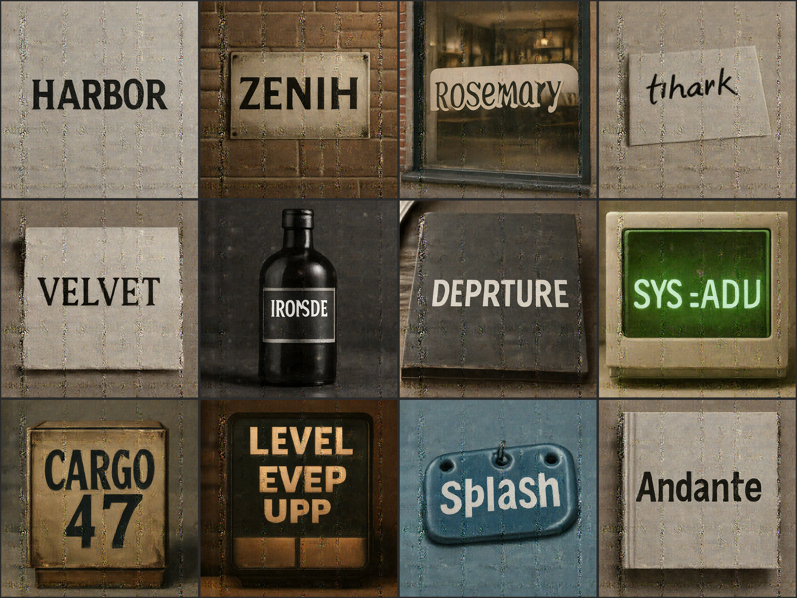
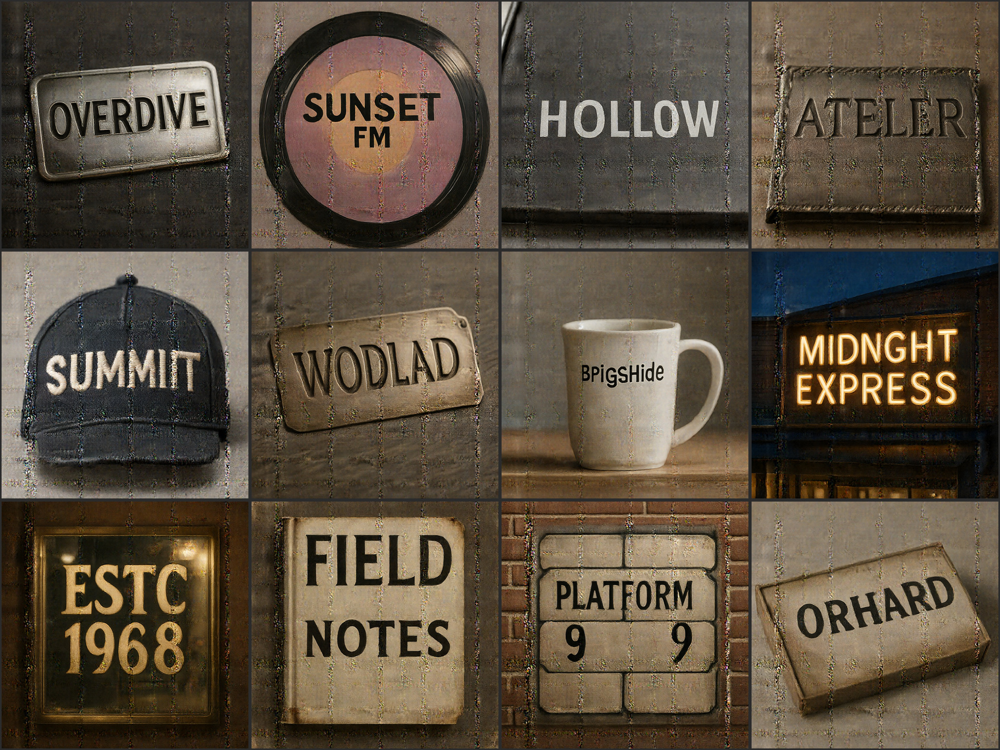

# 글자는 배웠지만 서체는 배우지 않았다 — 타이포그래피 프로브

작성일: 2026-07-20

PIERROT의 장면 텍스트(scene text) 학습셋 `ovis_image_text_synth`(129,991장)를 분석한 뒤, **학습셋에 없는 것만 골라** 1.6B 모델에 물어본 기록이다. 같은 형식의 인물 진단은 [person_coverage_probe.md](person_coverage_probe.md)에 있다.

## 0. 먼저 — 이건 원래 어려운 문제다

이미지 생성 모델이 글자를 제대로 쓰는 것은 **사람 손을 제대로 그리는 것과 같은 부류의 난제**로 여겨져 왔다. 이유가 비슷하다.

- **한 픽셀만 틀려도 사람이 즉시 알아챈다.** 나무 잎사귀는 몇 장 달라도 아무도 모르지만, `E`가 `F`가 되면 바로 보인다. 손가락이 여섯 개면 바로 보이는 것과 같다.
- **전역 구조와 국소 형태를 동시에 맞춰야 한다.** 글자 하나하나의 모양(국소)도 맞아야 하고, 그것들이 올바른 순서로 정렬(전역)돼야 한다. 손도 손가락 각각의 모양과 전체 배치가 함께 맞아야 한다.
- **확산 모델은 국소 질감을 잘 만들고 이산 기호를 잘 못 만든다.** 글자는 연속적인 질감이 아니라 **정해진 형태를 갖는 이산 기호**다. 노이즈를 걷어내는 방식과 잘 맞지 않는다.

그래서 이 축은 "데이터를 늘리면 되는" 문제가 아니라 **표현 방식과 데이터 설계를 같이 손봐야 하는** 문제다. 아래는 1차 실험에서 실제로 해 본 것들이다.

### 0.1 시도한 것 ① — LongCat의 따옴표 글자 단위 토크나이징

PIERROT는 [LongCat](https://github.com/Pierrot-vision/Reading-Papers)이 쓴 방식을 가져와 적용했다. 핵심은 이렇다.

일반적으로 텍스트 인코더는 단어를 통째로 또는 자주 쓰이는 조각(subword)으로 자른다. `"HARBOR"`가 `HAR` + `BOR` 두 조각이 되는 식이다. 이러면 모델은 **그 조각이 어떤 글자들로 이뤄졌는지**를 직접 보지 못한다. 철자를 맞추기 어려운 구조적 이유다.

LongCat 방식은 **따옴표 안에 있는 텍스트만 골라 글자 단위로 쪼갠다.**

```
프롬프트:  A book cover with the exact visible text "HARBOR".
           └──── 일반 BPE 토크나이징 ────┘        └ H·A·R·B·O·R ┘
                                                   글자 하나씩
```

따옴표 밖은 평소대로 처리하고 안쪽만 `H` `A` `R` `B` `O` `R`로 나누는 것이다. 모델이 "이 위치에 이 글자"라는 대응을 직접 배울 수 있게 된다. 구현은 [`pipeline/text_encoding.py`](../../pipeline/text_encoding.py)에 있고, `quote_char_encode_sources`로 지정한 **18개 텍스트 데이터셋에 적용**했다.

효과는 있었다. [vs_prx.md](vs_prx.md) 5.3절에서 보듯 짧은 문구(`DEEP WORK`)는 PIERROT가 PRX보다 정확하게 쓴다. 다만 아래 4절에서 보듯 **긴 문구·새 단어에서는 여전히 무너진다.**

### 0.2 시도한 것 ② — 데이터를 직접 만들어 커리큘럼을 깔았다

공개 텍스트 데이터셋(AnyWord 등)은 노이즈가 많았다. 실제로 `anyword_laion_multicap`은 **캡션당 단어 3개, OCR 조각(`"G"`, `"WE"`) 노이즈 11.1%** 문제로 비활성화했다.

그래서 필요한 형태를 **직접 생성**했다. 이름에 `synth`가 붙은 것들이다.

| 데이터셋 | 실제 이미지 | 원본과의 관계 |
| --- | --- | --- |
| `ovis_image_text_synth` | **129,991** | 원본 (기본 — 짧고 흔한 단어) |
| `ovis_image_text_synth_longspell` | 8,206 | ↑ 의 **부분집합** (이중자 + 7자 이상 필터) |
| `ovis_image_text_hard_synth` | 80,104 | **↑↑ 의 부분집합** (100% 포함, 어려운 철자만 추림) |
| `ovis_image_text_hard_synth_longspell` | 5,906 | ↑ 의 **부분집합** (같은 이중자 필터) |
| `ovis_scene_text_confusable_synth` | 7,731 → OCR 통과 **6,772** | 별도 생성 (혼동 글자쌍) |
| `ovis_scene_text_l1_synth_ocr` | 14,926 | 별도 생성 (난이도 1단계, OCR 검증) |

**표를 그냥 더하면 안 된다. 대부분이 같은 이미지다.**

`hard_synth` 80,104장은 `ovis_image_text_synth` 129,991장의 **100% 부분집합**이다(sample_id 대조로 확인). `longspell` 두 개는 각각 그 원본을 이중자 조건으로 거른 필터 뷰이고, 별도 폴더 없이 `converted_longspell/` 하위 경로로만 존재한다.

즉 **여섯 줄처럼 보이지만 실제 고유 이미지는 원본 129,991 + 별도 생성 2만여 장, 합쳐 15만 장 남짓**이다. 나머지는 같은 이미지를 조건만 바꿔 다시 넣은 것이다.

이 구조에는 의도가 있다. 어려운 샘플을 **여러 이름으로 중복 노출시켜 실질 학습 비중을 높이는** 방식이다. 다만 부작용도 분명하다.

- **다양성은 늘지 않는다.** 같은 이미지·같은 문구를 더 보는 것이지 새로운 글자 조합을 보는 것이 아니다. 원본이 106개 단어에 갇혀 있으므로(1절) 몇 번을 반복해도 **어휘는 그대로**다.
- **노출 비율이 실제보다 커 보인다.** 표의 2~3%가 여섯 줄이면 12~18%처럼 읽히지만, 겹치는 이미지를 걷어내면 실질 다양성 기여는 그보다 훨씬 작다.

### 0.3 그럼에도 남은 문제

위 두 가지를 다 하고도 4절에서 보듯 **철자 정확도는 절반 수준**이다. 그리고 이번 프로브로 **세 번째 문제**가 새로 드러났다 — 서체를 지정하는 능력이 아예 없다는 것이다. 아래는 그 진단이다.

## 1. 학습셋의 공백

캡션 7,580건을 슬롯 단위로 셌다. 캡션 형식은 다음 한 줄로 고정돼 있다.

> `A {장면} with the exact visible text "{텍스트}".`

| 축 | 학습셋 실태 |
| --- | --- |
| 텍스트 | 고유 문구 **238종**, 고유 단어 **106개**. `PIERROT` 38.2% · `GALLERY` 20.5% · `CLASSIC` 8.6% · `MAGAZINE` 7.8% · `NEW ARRIVAL` 4.9% |
| 장면 | **단 9종** (영화포스터·타이틀카드·로고·3D렌더·병라벨·책표지·네온간판·스티커·카페간판) |
| **서체·폰트** | `font` · `serif` · `sans-serif` · `typeface` · `typography` · `italic` · `script` · `handwritten` · `calligraphy` · `chrome` · `gradient` · `outlined` · `condensed` **전부 0%**. `bold`만 0.47% |

세 번째 줄이 핵심이다. **이 데이터셋은 "무슨 글자를 쓸지"만 가르치고 "어떤 서체로 쓸지"는 한 번도 가르치지 않았다.** `caption_short` / `caption_medium` / `caption_long` 세 변형을 다 뒤져도 서체 관련 단어가 없다.

## 2. 어떻게 물어봤나

학습 캡션 형식을 그대로 따르되 세 가지를 학습셋 밖으로 두었다.

- **서체 서술을 넣었다** — 학습셋 0%인 12종 폰트와 6종 표현 방식
- **새 텍스트를 썼다** — 학습셋 106개 단어와 **충돌 0건** (자동 검사로 확인)
- **새 장면을 썼다** — 9종 밖의 매체 (레터프레스·타일 모자이크·자수 캡·나무 표지판 등)

전문은 [ovis_probe_prompts.json](../ovis_probe_prompts.json)에 있다.

| 항목 | 값 |
| --- | --- |
| 모델 | PIERROT 1.6B — phase3 step **935k** (EMA) |
| 해상도 / step / CFG | 1024 × 1024 / 28 / 4.0 |
| seed | 42 (프롬프트마다 고정) |
| chi_prompt | OFF |

| 축 | id | 요청한 서체 |
| --- | --- | --- |
| 폰트 종류 | 1–12 | serif · geometric sans · script · handwritten · calligraphy · blackletter · condensed · monospace · stencil · pixel · bubble · italic |
| 표현 방식 | 13–18 | chrome · gradient · outline · emboss · embroidery · carved |
| 대소문자·길이 | 19–22 | 대소문자 혼합 · 긴 두 단어 · 숫자 포함 · 2행 배치 |
| 신규 장면 | 23–24 | 타일 모자이크 · 나무 스탬프 |

## 3. 결과

### 3.1 폰트 종류 (id 1–12)



### 3.2 표현 방식 · 배치 · 신규 장면 (id 13–24)



## 4. 관찰

두 가지를 따로 봐야 한다 — **철자가 맞았는가**와 **요청한 서체로 나왔는가**.

| 항목 | 결과 |
| --- | --- |
| **철자** | 24개 중 **12개 정확** (HARBOR · Rosemary · VELVET · CARGO 47 · Splash · Andante · HOLLOW · SUNSET FM · FIELD/NOTES · MIDNIGHT EXPRESS 등) |
| 철자 오류 유형 | **글자 누락**이 대부분 — `ZENIH`(T), `IRONSDE`(I), `DEPRTURE`(A), `ATELER`(I), `ORHARD`(C), `MIDNGHT`(I) |
| 심한 붕괴 | `thank you`→`tihark`, `SYS_READY`→`SYS =ADU`, `LEVEL UP`→`LEVEL EVEP UPP`, `WOODLAND`→`WODLAD`, `BrightSide`→`BPigSHide`, `EST. 1968`→`ESTC 1968` |
| **서체** | **거의 전부 실패.** serif를 요청한 HARBOR가 산세리프로, calligraphy를 요청한 VELVET이 평범한 세리프로, italic을 요청한 Andante가 직립으로 나왔다. blackletter · condensed · pixel · stencil도 반영되지 않았다 |
| 서체 부분 성공 | script(Rosemary) · handwritten(글자는 틀렸으나 필기체 질감) · bubble(Splash)만 어렴풋이 반영 |
| 표현 방식 | emboss(ATELIER) · embroidery(SUMMIT) · 네온(MIDNIGHT EXPRESS) · 금박(EST. 1968)은 **재질 표현이 살아 있다**. chrome · gradient · outline은 약함 |
| 배치 | 2행 배치(FIELD / NOTES)는 성공. 숫자(CARGO 47 · PLATFORM 9)도 형태는 나오나 `9`가 두 번 찍혔다 |

## 5. 정리 — 2라운드 데이터에 주는 함의

- **서체 제어는 능력이 아니라 학습의 부재다.** 캡션에 서체 단어가 0%이므로 모델은 그 축을 조건으로 쓸 방법을 배운 적이 없다. 요청을 무시하고 학습셋에서 가장 흔한 굵은 산세리프로 되돌아간다. **캡션에 서체 슬롯을 넣는 것만으로 열릴 여지가 있는 축**이다.
- **재질 표현은 이미 된다.** emboss·embroidery·네온·금박은 요청대로 나왔다. 이것들은 서체가 아니라 **장면·재질**의 속성이고, 학습셋 9종 장면에 유사한 것이 있었기 때문으로 보인다. 서체와 재질을 구분해서 계획해야 한다.
- **철자는 여전히 절반이다.** 24개 중 12개만 정확하고, 오류는 대부분 **글자 하나 누락**이다. [vs_prx.md](vs_prx.md) 5.3절의 "획득 후 흔들림"과 같은 성격이다.
- **겨냥은 맞았으나 같은 이미지를 다시 본 것이었다.** 0.2절에서 만든 `longspell`(이중자)·`hard_synth`(어려운 철자)는 정확히 이 문제를 노렸지만, **전부 원본 129,991장에서 조건을 걸어 뽑은 부분집합**이다. 새로운 글자 조합을 추가한 것이 아니라 어려운 것을 더 자주 보게 만든 것이다. 그래서 이번에도 `IRONSDE`·`DEPRTURE`처럼 **글자 누락이 그대로 재현**됐다.
- **2라운드에서는 반복이 아니라 어휘를 늘려야 한다.** 같은 이미지를 몇 번 더 보여줘도 106개 단어 안에서 도는 한 새 단어의 철자는 늘지 않는다. 필터로 비중을 조절하는 방식과 **새 이미지를 실제로 생성하는 방식**을 구분해서 계획해야 한다.
- **텍스트 어휘를 넓혀야 한다.** `PIERROT` 하나가 38%를 차지하는 분포로는 임의의 단어를 쓰는 능력이 자라기 어렵다. **단어 수를 수천 종으로 늘리고 특정 단어 편중을 없애는 것**이 반복 노출보다 우선이다.
- **한계** — 프롬프트당 1장·seed 1개다. 철자는 seed에 민감하므로 판정을 확정으로 읽으면 안 된다.

## 6. 관련 문서

- [person_coverage_probe.md](person_coverage_probe.md) — 같은 형식의 인물 학습셋 진단
- [round1_experiment_report.md](round1_experiment_report.md) — 1차 실험 결산 (3절 학습셋 문제)
- [vs_prx.md](vs_prx.md) — 외부 모델 비교 (5.3절 텍스트 렌더링 획득 곡선)
- [ovis_probe_prompts.json](../ovis_probe_prompts.json) — 프롬프트 24개 전문 + 학습셋 분포 수치
