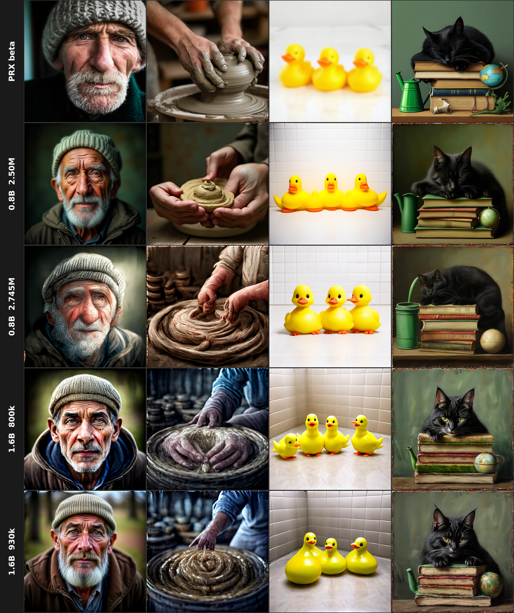
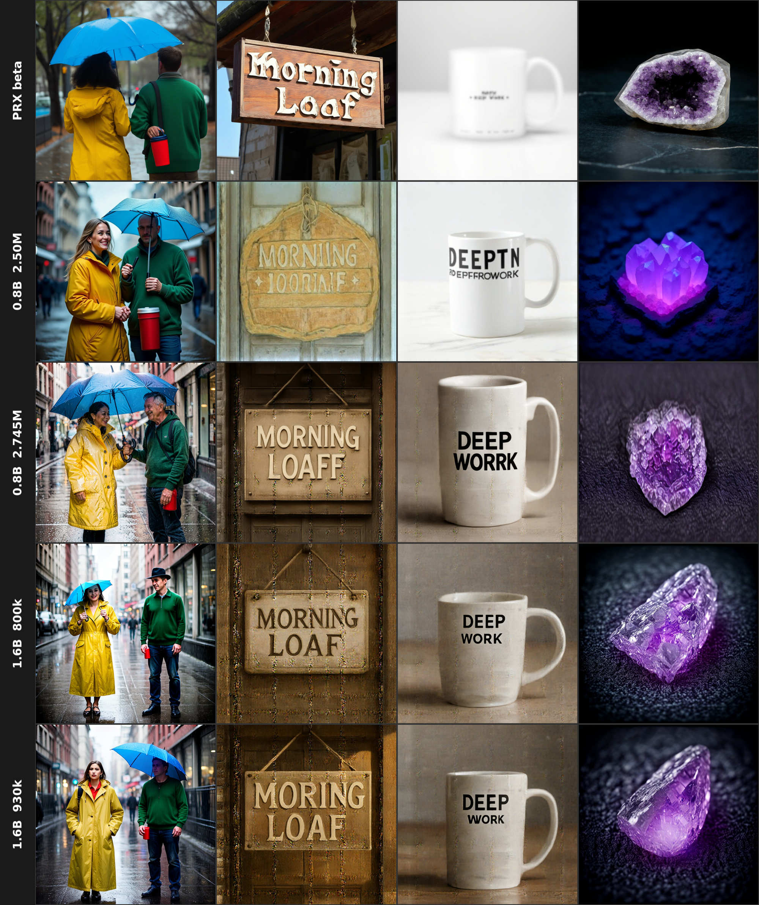
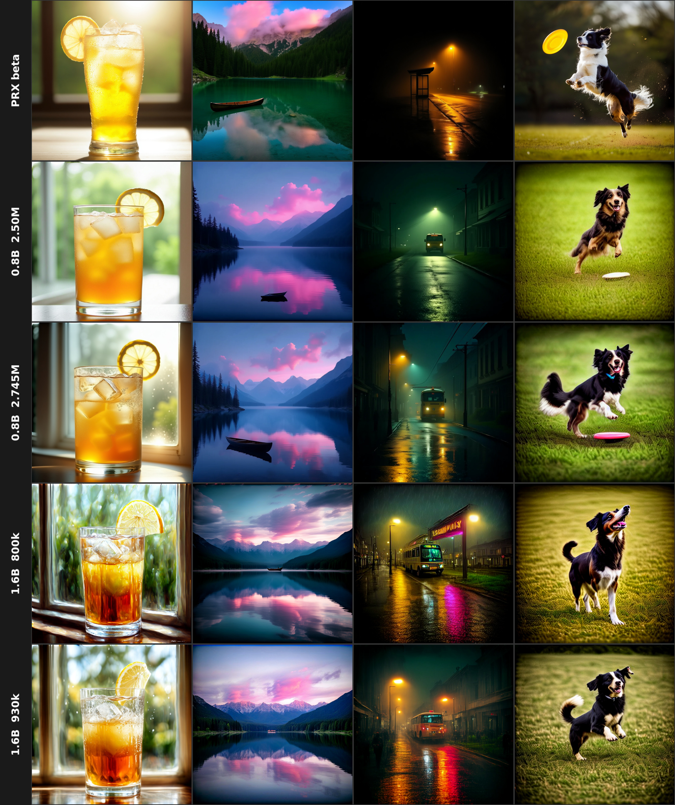
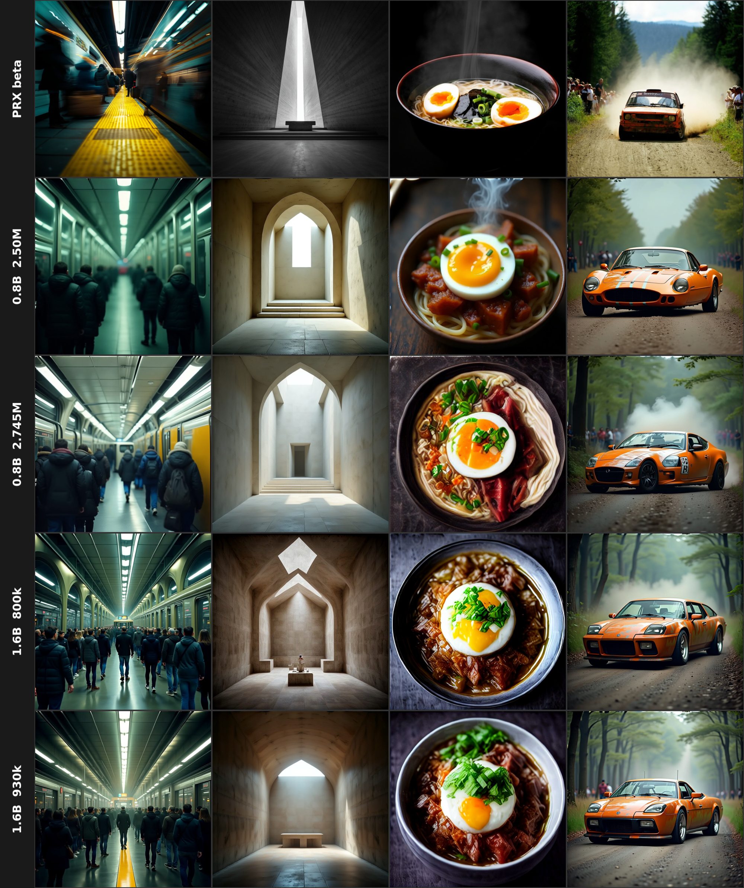
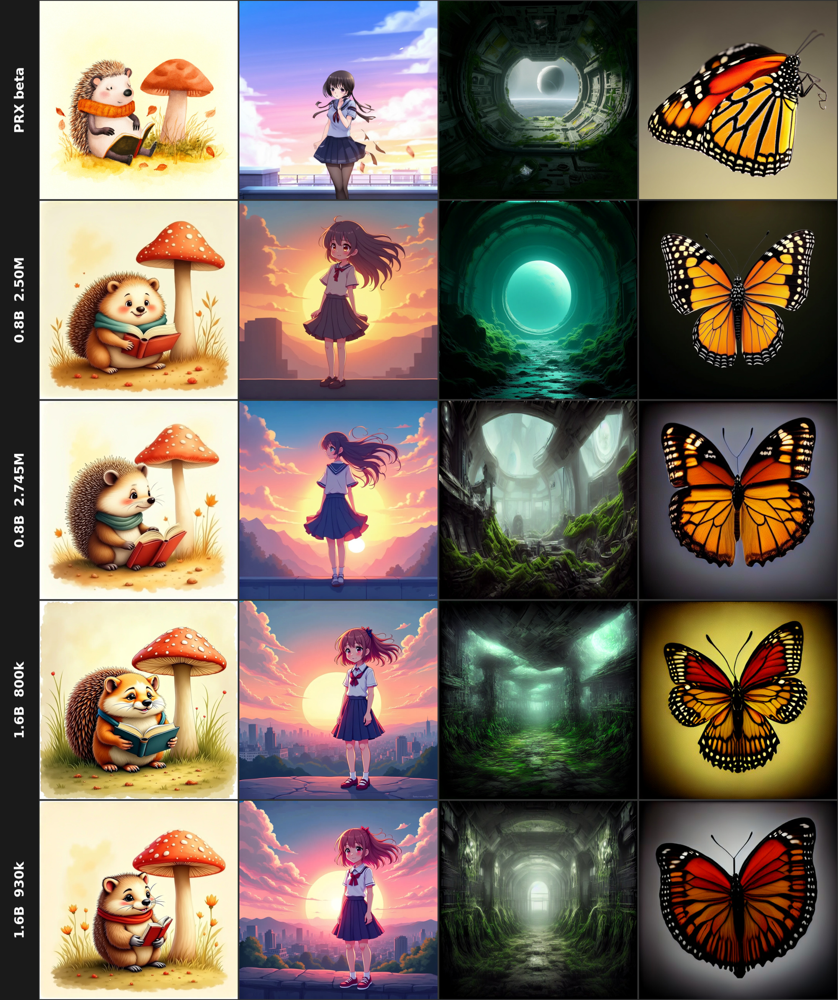

# PIERROT 0.8B · 1.6B vs PRX — 같은 프롬프트 비교 관찰

작성일: 2026-07-20

이 문서는 PIERROT의 체크포인트 **4개**와 **PRX**(Photoroom의 오픈소스 T2I 모델)를 **같은 프롬프트 20개**로 나란히 생성해 눈으로 비교한 기록이다.

체급마다 두 시점씩 넣은 이유는, 한 장에서 두 가지를 동시에 보기 위해서다. **가로로는 외부 모델과의 위치**, **세로로는 학습이 진행되며 무엇이 좋아지고 무엇이 나빠졌는지**를 읽을 수 있다.

PRX를 비교 대상으로 고른 이유는 PIERROT가 구조 설계 단계에서 PRX를 참고했기 때문이다. 비슷한 규모의 공개 모델이면서 계보상 연결이 있어, "우리가 어디쯤 와 있는가"를 재는 기준으로 적당하다.

숫자 지표(FID 등)는 없다. 눈으로 본 관찰만 담는다. 그리고 **아래 4절의 공정성 한계를 먼저 읽고** 결과를 해석하기 바란다.

## 1. 비교 대상

시트에 나오는 순서(위 → 아래)대로다.

| # | 모델 | 체크포인트 | 파라미터 | 레이어 |
| --- | --- | --- | --- | --- |
| 1 | **PRX** | `Photoroom/prx-1024-t2i-beta` | 약 1.17B | — |
| 2 | **PIERROT 0.8B** | phase2 step **2.5M** | 약 0.857B | 16 |
| 3 | **PIERROT 0.8B** | phase2 step **2.745M** | 약 0.857B | 16 |
| 4 | **PIERROT 1.6B** | phase3 step **800k** | 약 1.6B | 33 |
| 5 | **PIERROT 1.6B** | phase3 step **930k** | 약 1.6B | 33 |

공통 구성은 다음과 같다.

| 항목 | PIERROT (4개 전부) | PRX |
| --- | --- | --- |
| 텍스트 인코더 | Qwen3-4B (레이어 9·18·27 concat) | T5Gemma 2.61B |
| VAE | FLUX.2-small-decoder (32ch) | AutoencoderKL |
| 목적함수 / 스케줄 | Flow Matching `x_prediction` / `snr_shift` | Flow Matching / `FlowMatchEulerDiscrete` (shift 3.0) |
| 상태 | **학습 진행 중** | 공개 배포된 beta |

1.6B는 0.8B에서 레이어를 늘려 이어 학습한 모델이라([1.6b_training_review.md](1.6b_training_review.md) 3.0절), 넷은 하나의 계보 위에 있다. 텍스트 인코더는 PIERROT 넷이 모두 같고, **PRX만 T5Gemma 2.61B로 다르다.**

## 2. 생성 조건

프롬프트 20개 전문은 **[vs_prx_prompts.json](vs_prx_prompts.json)** 에 있다. 기존 관찰 기록([0.8b_training_review.md](0.8b_training_review.md) / [1.6b_training_review.md](1.6b_training_review.md))에서 쓴 60개 프롬프트와 **겹치지 않는 신규 세트**이며, 능력 축별로 하나씩 배치했다.

| 항목 | PIERROT (4개 전부) | PRX |
| --- | --- | --- |
| 해상도 | 1024 × 1024 | 1024 × 1024 |
| 샘플링 step | 28 | 28 |
| guidance scale (CFG) | **4.0** (PIERROT 기본값) | **5.0** (PRX 권장값) |
| seed | 42 | 42 |
| negative prompt | 없음 | 없음 |

CFG만 다르다. 각 모델이 **자기 권장값에서 가장 잘 나오도록** 맞춘 것이라, "각자 최선의 조건에서의 비교"에 해당한다. 같은 CFG로 맞추면 한쪽이 권장 범위를 벗어나 불리해진다.

프롬프트 축은 다음과 같다.

| 축 | id | 무엇을 보려는가 |
| --- | --- | --- |
| portrait / hands_anatomy | 1, 2 | 얼굴·손 같은 사람이 민감하게 보는 부위 |
| counting / spatial / attr_binding | 3, 4, 5 | 개수 세기, 위치 관계, "누가 무슨 색을 입었는가" |
| text_render | 6, 7 | 이미지 안에 정확한 글자 쓰기 |
| still_life / transparency / reflection / macro_texture | 8, 9, 10, 20 | 재질·투명도·반사·미세 질감 |
| night_lowlight / motion / crowd_scene | 11, 12, 13 | 저조도, 움직임 정지, 복잡한 장면 |
| architecture / food / vehicle | 14, 15, 16 | 구조물·음식·기계의 형태 정확도 |
| illustration / anime_style / scifi_concept | 17, 18, 19 | 사진이 아닌 스타일 요청에 대한 반응 |

## 3. 결과

각 시트는 다섯 줄이고, **각 줄 왼쪽에 어느 모델인지 라벨이 붙어 있다.** 같은 열은 같은 프롬프트다.

| 줄 | 라벨 | 모델 |
| --- | --- | --- |
| 1 | `PRX beta` | PRX `prx-1024-t2i-beta` |
| 2 | `0.8B 2.50M` | PIERROT 0.8B · phase2 step 2,500,000 |
| 3 | `0.8B 2.745M` | PIERROT 0.8B · phase2 step 2,745,000 |
| 4 | `1.6B 800k` | PIERROT 1.6B · phase3 step 800,000 |
| 5 | `1.6B 930k` | PIERROT 1.6B · phase3 step 930,000 |

2·3번 줄이 0.8B의 두 시점, 4·5번 줄이 1.6B의 두 시점이다. **가로로 읽으면 모델 간 비교, 세로로 읽으면 학습 진행에 따른 변화**가 된다.

> **비교 대상은 단계적으로 늘려 왔고, 각 단계의 시트를 모두 남겨 두었다.** 나중에 어느 시점의 비교였는지 되짚을 수 있게 하기 위함이다.
>
> | 단계 | 파일 | 구성 |
> | --- | --- | --- |
> | 2모델 | `vs_prx_sheetN_2models_20260720.jpg` | PRX / 1.6B 930k |
> | 3모델 | `vs_prx_sheetN_3models_20260720.jpg` | + 0.8B 2.745M |
> | 4모델 | `vs_prx_sheetN_4models_20260720.jpg` | + 0.8B 2.5M |
> | **5모델** | `vs_prx_sheetN_5models_20260720.jpg` | + 1.6B 800k **(아래 게재본)** |

### 3.1 인물 · 손 · 개수 · 공간 (id 1–4)

### 3.2 속성 결합 · 텍스트 · 정물 (id 5–8)

### 3.3 투명 · 반사 · 야간 · 모션 (id 9–12)

### 3.4 군중 · 건축 · 음식 · 차량 (id 13–16)

### 3.5 일러스트 · 애니 · SF · 매크로 (id 17–20)

## 4. 공정성 한계 — 반드시 같이 읽을 것

이 비교는 **동등한 조건의 벤치마크가 아니다.** 다음을 감안해야 한다.

1. **학습 단계가 다르다.** PIERROT 두 모델 모두 아직 base pretraining이 **진행 중인 중간 체크포인트**이고, PRX는 학습을 마치고 배포된 beta다. 완성된 제품과 공사 중인 건물을 비교하는 셈이다.
2. **PIERROT는 post-training을 거치지 않았다.** 0.8B·1.6B 모두 base 그대로다. PRX는 공개 전 품질 튜닝(미적 정렬 등)이 들어갔을 가능성이 높다. 지금 PIERROT는 base 그대로다.
3. **텍스트 인코더 구성이 다르다.** PRX는 T5Gemma 2.61B를 그대로 쓰고, PIERROT는 Qwen3-4B의 중간 레이어 3개를 뽑아 concat하는 방식이다. 프롬프트 충실도 차이의 일부는 여기서 올 수 있다.
4. **학습 예산이 비교 불가하다.** PRX의 실제 GPU 예산은 공개 정보가 제한적이고, PIERROT는 1인 프로젝트 예산이다.
5. **샘플은 프롬프트당 1장, seed 1개다.** seed를 바꾸면 결과가 뒤집히는 항목이 분명히 있다. 특히 5.4의 '퇴행'은 표본 1장에 기댄 관찰이라 확정된 결론이 아니다.
6. **회화풍 편향이 결과에 섞여 있다.** [1.6b_training_review.md](1.6b_training_review.md)에 적었듯 PIERROT phase3는 400k 이후 유화풍 편향이 쌓여 있다. id 4(고양이·책)에서 유화로 변한 것이 대표적이다. 이건 모델 능력의 한계라기보다 **데이터 분포에서 온 스타일 문제**다.

## 5. 장단점

승패를 세는 대신, 20개에서 반복해 드러난 경향을 정리한다. 체크포인트를 4개 넣으니 **"PIERROT의 특성"과 "학습 중 변한 것"이 구분되기 시작했다.**

### 5.1 PIERROT의 장점

- **속성 결합(attribute binding)이 강하다.** 여러 인물에게 각기 다른 색 옷과 소지품을 지정한 프롬프트(id 5)에서 네 체크포인트 모두 노란 우비·파란 우산·초록 스웨터·빨간 보온병을 정확히 배치했고, 인물도 정면으로 세웠다. PRX는 두 인물을 뒷모습으로 그려 누가 무엇을 들었는지 모호했다.
- **텍스트 렌더링이 학습과 함께 확실히 자란다.** 5.3에서 따로 다룬다. 최신 체크포인트는 짧은 문구에서 PRX보다 낫다.
- **분위기와 색감의 설득력이 높다.** 야간 도시(id 11), SF 폐선 내부(id 19)에서 화면 자체의 밀도는 PIERROT 쪽이 높다. 다만 이 장점은 아래 단점(프롬프트 충실도)과 붙어 있다.
- **반사 대칭을 잘 잡는다.** 호수 반사(id 10)에서 요청한 좌우 대칭이 PIERROT 쪽에서 더 정확했다.

### 5.2 PIERROT의 단점

- **동작·순간 포착이 약하다.** 가장 뚜렷한 약점이다. "공중에 뜬"(id 12 프리스비), "드리프트 중인"(id 16 랠리카)을 **네 체크포인트가 전부** 무시하고 정적인 장면을 그렸다. PRX는 둘 다 순간을 포착했다. 서로 다른 프롬프트가 같은 방향으로, 그리고 체급·학습량과 무관하게 실패했다.
- **정확한 구조가 필요한 곳에서 무너진다.** 천창에서 떨어지는 빛의 기하(id 14)는 네 체크포인트 모두 아치 통로로 바뀌었고, 나비 비늘(id 20)은 표본 사진처럼 평평하다.
- **프롬프트 충실도가 떨어진다.** 요청하지 않은 것을 넣거나(id 11 — "텅 빈 정류장"에 버스와 사람 추가) 요청한 것을 빠뜨린다(id 19 — 고리 행성 누락, id 10 — 카누 누락).
- **회화풍 편향이 남아 있다.** 사진을 요청해도 유화 질감이 섞인다(id 4 고양이·책). 학습 데이터 분포에서 온 스타일 문제이며 경과는 [1.6b_training_review.md](1.6b_training_review.md)에 있다.
- **미세 질감의 사실성이 부족하다.** 정동석 결정(id 8)은 네 체크포인트 모두 매끈한 보석처럼 나왔고, 라멘(id 15)은 면발이 보이지 않는 스튜에 가깝다. PRX가 확실히 앞선다.

### 5.3 학습이 진행되며 좋아진 것 — 텍스트 렌더링

네 시점을 나란히 보면 **글자 쓰기 능력이 단계적으로 자라는 과정**이 그대로 보인다.

| 체크포인트 | id 6 "MORNING LOAF" | id 7 "DEEP WORK" |
| --- | --- | --- |
| 0.8B 2.5M | `MORNIING IOODINE` — 판독 불가 | `DEEPTN RD EPFFROWORK` — 판독 불가 |
| 0.8B 2.745M | `MORNING LOAFF` — F 중복 | `DEEP WORRK` — R 중복 |
| 1.6B 800k | `MORNING LOAF` — **정확** | `DEEP WORK` — **정확** |
| 1.6B 930k | `MORING LOAF` — N 누락 | `DEEP WORK` — **정확** |
| (참고) PRX | `MORNING LOAF` — 정확 | 뭉개져 판독 불가 |

**판독 불가 → 글자 중복 → 정확**의 순서로 올라간다. 2.5M에서는 글자 비슷한 형태만 만들다가, 2.745M에서 단어를 거의 맞추되 글자를 하나씩 덧붙이고, 1.6B에 와서 정확해진다. 따옴표 안 텍스트를 글자 단위로 토큰화하는 처리가 학습량이 쌓이면서 실제로 작동하기 시작했다고 볼 수 있다.

다만 **930k에서 긴 문구가 다시 틀린 것**(`MORING LOAF`)은 주의할 지점이다. 짧은 문구는 유지되는데 긴 문구만 무너졌으므로, 단조롭게 좋아지기만 하는 것은 아니다. 글자 수를 4·8·12·16자로 늘려 가며 측정하면 어디서 무너지는지 경계를 잡을 수 있다.

### 5.4 학습이 진행되며 오히려 나빠진 것 — 손

**손은 반대 방향으로 움직였다.** id 2(물레 위 점토를 빚는 손)에서 0.8B 2.5M은 두 손이 점토를 감싼 형태가 비교적 온전했는데, 2.745M·800k·930k로 갈수록 손가락과 점토가 뒤엉킨 소용돌이로 무너졌다.

**개수 세기(id 3)도 흔들린다.** 2.5M·2.745M·930k는 오리를 3개로 맞췄지만, **800k는 4개를 그렸다.** 학습량이 많다고 항상 정확해지는 것이 아니다.

두 항목 모두 회화풍 편향이 짙어지는 구간과 시점이 겹친다. 스타일이 사진에서 멀어지면서 구조 정확도까지 함께 끌려 내려간 것인지, 아니면 독립된 퇴행인지는 이 표본만으로 판단할 수 없다.

### 5.5 깊이 성장(0.8B → 1.6B)이 준 것

- **얻은 것**: 텍스트 정확도(5.3), 인물 표현의 정돈도. 지하철 승강장(id 13)의 공간 깊이감도 1.6B 쪽이 낫다.
- **얻지 못한 것**: 손(id 2), 동작 포착(id 12·16), 예배당 빛(id 14)은 체급을 키워도 그대로 실패했다. **파라미터를 늘려서 풀리는 문제가 아니라는 뜻**이고, 데이터나 학습 방식에서 답을 찾아야 한다.
- **잃은 것**: 공간 관계(id 4)에서 0.8B는 물뿌리개·책·고양이·지구본을 모두 배치했지만, 1.6B 두 시점은 물뿌리개가 주둥이만 남거나 사라졌다.

### 5.6 다음에 볼 것

- 동작·액션 계열 캡션의 학습 비중을 확인한다. 네 체크포인트가 모두 같은 방식으로 실패한 것은 데이터 부족을 강하게 시사한다.
- 손 품질을 전용 프롬프트 세트로 여러 시점에 걸쳐 측정해, 5.4의 퇴행이 실제인지 표본 우연인지 가린다.
- 텍스트 길이별(4·8·12·16자) 정확도를 측정해 5.3의 경계를 잡는다.
- 회화풍 편향이 정리된 뒤 같은 20개를 다시 돌려, 스타일 문제와 구조 정확도 문제를 분리한다.

## 6. 재현 방법

프롬프트와 조건은 [vs_prx_prompts.json](vs_prx_prompts.json)에 있다. PRX는 `Photoroom/prx-1024-t2i-beta`를 diffusers로 불러 `num_inference_steps=28, guidance_scale=5.0, seed=42`로, PIERROT는 phase2 step 2.5M·2.745M(0.8B)과 phase3 step 800k·930k(1.6B)의 EMA 체크포인트를 각각 `28 steps, guidance_scale=4.0, seed=42, chi_prompt OFF`로 생성했다. 다섯 모델 모두 1024²·bf16이다.

## 7. 관련 문서

- [0.8b_training_review.md](0.8b_training_review.md) — 0.8B step별 관찰 기록
- [1.6b_training_review.md](1.6b_training_review.md) — 1.6B step별 관찰 기록
- [SFT.md](SFT.md) — SFT 실험 일기
