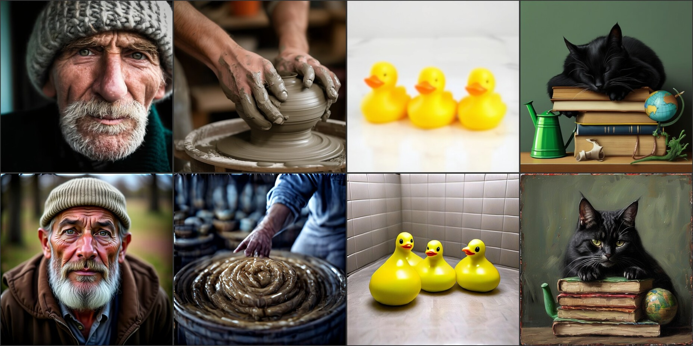
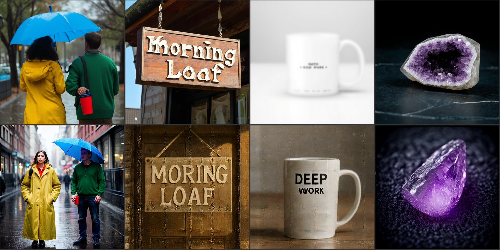
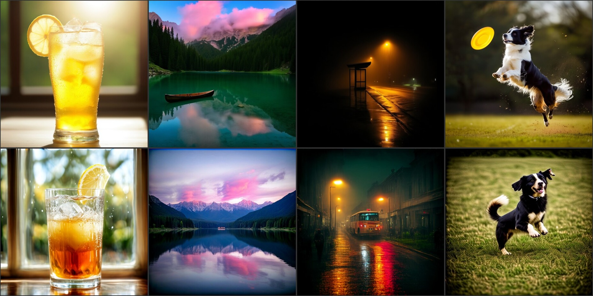
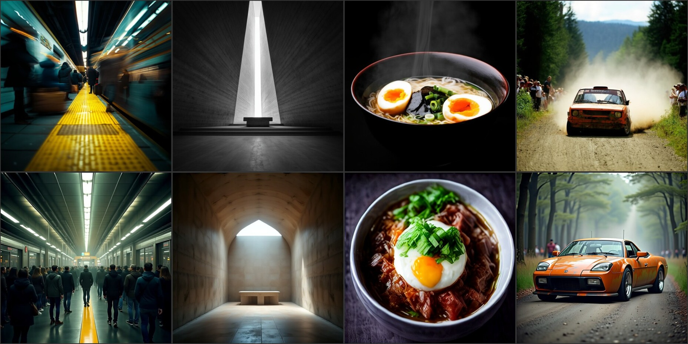
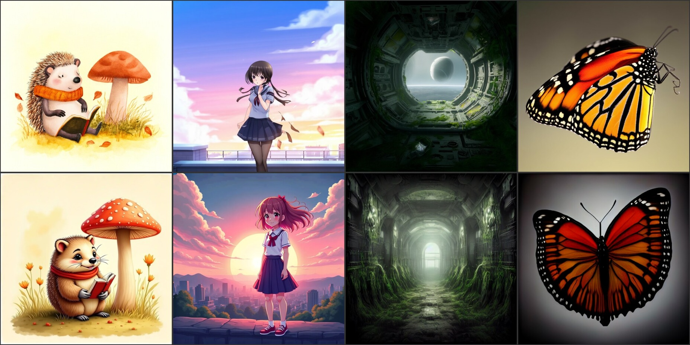

# PIERROT 1.6B vs PRX — 같은 프롬프트 비교 관찰

작성일: 2026-07-20

이 문서는 PIERROT 1.6B(phase3, step 930k)와 **PRX**(Photoroom의 오픈소스 T2I 모델)를 **같은 프롬프트 20개**로 나란히 생성해 눈으로 비교한 기록이다.

PRX를 비교 대상으로 고른 이유는 PIERROT가 구조 설계 단계에서 PRX를 참고했기 때문이다. 비슷한 규모의 공개 모델이면서 계보상 연결이 있어, "우리가 어디쯤 와 있는가"를 재는 기준으로 적당하다.

숫자 지표(FID 등)는 없다. 눈으로 본 관찰만 담는다. 그리고 **아래 4절의 공정성 한계를 먼저 읽고** 결과를 해석하기 바란다.

## 1. 비교 대상

| 항목 | PIERROT | PRX |
| --- | --- | --- |
| 체크포인트 | phase3 step **930k** (EMA) | `Photoroom/prx-1024-t2i-beta` |
| 트랜스포머 파라미터 | 약 1.6B | 약 1.17B |
| 텍스트 인코더 | Qwen3-4B (레이어 9·18·27 concat) | T5Gemma 2.61B |
| VAE | FLUX.2-small-decoder (32ch) | AutoencoderKL |
| 목적함수 / 스케줄 | Flow Matching `x_prediction` / `snr_shift` | Flow Matching / `FlowMatchEulerDiscrete` (shift 3.0) |
| 상태 | **학습 진행 중** (base pretraining) | 공개 배포된 beta |

트랜스포머만 보면 PIERROT가 조금 크지만, **텍스트 인코더는 PRX가 2.61B로 더 크다.** 텍스트 이해력에서 PRX가 유리할 수 있는 구조다.

## 2. 생성 조건

프롬프트 20개 전문은 **[vs_prx_prompts.json](vs_prx_prompts.json)** 에 있다. 기존 관찰 기록([0.8b_training_review.md](0.8b_training_review.md) / [1.6b_training_review.md](1.6b_training_review.md))에서 쓴 60개 프롬프트와 **겹치지 않는 신규 세트**이며, 능력 축별로 하나씩 배치했다.

| 항목 | PIERROT | PRX |
| --- | --- | --- |
| 해상도 | 1024 × 1024 | 1024 × 1024 |
| 샘플링 step | 28 | 28 |
| guidance scale (CFG) | **4.0** (PIERROT 기본값) | **5.0** (PRX 모델 카드 권장값) |
| seed | 42 | 42 |
| negative prompt | 없음 | 없음 |

CFG만 다르다. 각 모델이 **자기 권장값에서 가장 잘 나오도록** 맞춘 것이라, "각자 최선의 조건에서의 비교"에 해당한다. 같은 CFG로 맞추면 한쪽이 권장 범위를 벗어나 불리해진다.

프롬프트 축은 다음과 같다.

| 축 | id | 무엇을 보려는가 |
| --- | --- | --- |
| portrait / hands_anatomy | 1, 2 | 얼굴·손 같은 사람이 민감하게 보는 부위 |
| counting / spatial / attr_binding | 3, 4, 5 | 개수 세기, 위치 관계, "누가 무슨 색을 입었는가" |
| text_render | 6, 7 | 이미지 안에 정확한 글자 쓰기 |
| still_life / transparency / reflection / macro_texture | 8, 9, 10, 20 | 재질·투명도·반사·미세 질감 |
| night_lowlight / motion / crowd_scene | 11, 12, 13 | 저조도, 움직임 정지, 복잡한 장면 |
| architecture / food / vehicle | 14, 15, 16 | 구조물·음식·기계의 형태 정확도 |
| illustration / anime_style / scifi_concept | 17, 18, 19 | 사진이 아닌 스타일 요청에 대한 반응 |

## 3. 결과

각 시트는 **위 줄이 PRX, 아래 줄이 PIERROT**다. 같은 열이 같은 프롬프트다.

### 3.1 인물 · 손 · 개수 · 공간 (id 1–4)

| id | 관찰 |
| --- | --- |
| 1 인물 | 둘 다 노인 어부의 주름과 수염을 잘 표현했다. PRX가 얕은 심도와 피부 질감이 조금 더 사진답고, PIERROT는 얼굴이 약간 붉고 배경 보케가 더 강하다. **근소하게 PRX 우세.** |
| 2 손 | **PRX 완승.** PRX는 물레 위 점토를 감싼 두 손이 해부학적으로 정확하다. PIERROT는 손가락 형태가 뭉개지고 점토가 소용돌이 덩어리로 붕괴했다. |
| 3 개수(오리 3개) | **둘 다 3개를 정확히 그렸다.** PRX는 매끈한 제품컷, PIERROT는 오리 크기가 들쭉날쭉하고 모양이 덜 정돈됐다. |
| 4 공간 관계 | **PRX 우세.** PRX는 "책 위 고양이 + 왼쪽 초록 물뿌리개 + 오른쪽 지구본"을 모두 배치했다(오른쪽 아래 잡물 있음). PIERROT는 물뿌리개가 주둥이만 남고 전체가 유화풍으로 변했다. |

### 3.2 속성 결합 · 텍스트 · 정물 (id 5–8)

| id | 관찰 |
| --- | --- |
| 5 속성 결합 | **PIERROT 우세.** 네 개 속성(노란 우비·파란 우산·초록 스웨터·빨간 보온병)을 PIERROT는 전부 맞췄고 인물도 정면으로 세웠다. PRX는 둘 다 뒷모습이라 얼굴이 없고 우산을 누가 들었는지 모호하다. |
| 6 텍스트 "MORNING LOAF" | **PRX 우세.** PRX는 철자가 완전히 정확하다. PIERROT는 `MORING LOAF`로 **N이 빠졌다.** |
| 7 텍스트 "DEEP WORK" | **PIERROT 완승.** PIERROT는 "DEEP WORK"를 크고 또렷하게 썼다. PRX는 글자가 뭉개져 판독 불가다. |
| 8 정물(정동석) | **PRX 우세.** PRX는 자수정 결정 알갱이와 흰 테두리가 실제 정동석답다. PIERROT는 결정이 아니라 매끈한 보석처럼 나왔다. |

### 3.3 투명 · 반사 · 야간 · 모션 (id 9–12)

| id | 관찰 |
| --- | --- |
| 9 투명(아이스티) | 둘 다 좋다. PRX가 유리컵 결로와 얼음 투과가 조금 더 사실적이고, PIERROT는 색 대비가 강하다. **근소하게 PRX.** |
| 10 반사(호수) | **갈림.** 요청한 대칭 반사는 PIERROT가 더 정확하다. 다만 PIERROT는 카누를 거의 빠뜨렸고, PRX는 카누를 명확히 그렸다. |
| 11 야간 버스정류장 | **갈림.** PRX는 "텅 빈 정류장"이라는 요청에 충실하고 분위기가 좋다. PIERROT는 프롬프트에 없는 버스와 사람을 넣었지만 도시 야경 자체는 화려하다. **프롬프트 충실도는 PRX.** |
| 12 모션(프리스비) | **PRX 완승.** PRX는 개가 공중에 떠서 원반을 무는 순간을 잡았다. PIERROT는 개가 땅에 있고 **원반이 아예 없다.** |

### 3.4 군중 · 건축 · 음식 · 차량 (id 13–16)

| id | 관찰 |
| --- | --- |
| 13 군중 지하철 | **PRX 우세.** PRX는 열차 모션블러와 노란 안전선이 살아 있는 실제 승강장이다. PIERROT는 사람은 많지만 열차가 없고 공간이 복도처럼 보인다. |
| 14 콘크리트 예배당 | **PRX 완승.** PRX는 좁은 천창에서 제단으로 떨어지는 빛줄기를 정확히 구현했다. PIERROT는 아치 통로에 벤치가 놓인 다른 구조가 됐다. |
| 15 라멘 | **PRX 우세.** PRX는 반숙란 두 쪽·김·파·면이 모두 라멘답고 김이 오른다. PIERROT는 국물이 걸쭉한 스튜에 가깝고 면이 안 보인다. |
| 16 랠리카 드리프트 | **PRX 완승.** PRX는 자갈길 위 흙먼지와 드리프트 동작이 살아 있다. PIERROT는 포장도로에 정지한 스포츠카를 그렸다 — **동작·노면 모두 빗나갔다.** |

### 3.5 일러스트 · 애니 · SF · 매크로 (id 17–20)

| id | 관찰 |
| --- | --- |
| 17 동화 삽화(고슴도치) | **PRX 우세.** PRX는 고슴도치 가시가 정확하고 수채 느낌이 산다. PIERROT는 가시가 사라져 햄스터에 가까워졌다. |
| 18 애니메이션 | **호각.** 둘 다 셀 셰이딩과 노을이 좋다. PRX가 원화 스타일에 가깝고, PIERROT는 채색이 진하고 배경 도시가 화려하다. 취향 차이. |
| 19 SF 폐선 내부 | **갈림.** PRX는 요청한 "고리 행성이 보이는 뷰포트"를 그렸다. PIERROT는 행성을 빠뜨렸지만 이끼로 뒤덮인 복도의 분위기는 더 강렬하다. **프롬프트 충실도는 PRX.** |
| 20 나비 매크로 | **PRX 우세.** PRX는 비늘 질감과 더듬이·다리가 살아 있는 접사다. PIERROT는 표본 사진처럼 평평하고 비늘 디테일이 없다. |

## 4. 공정성 한계 — 반드시 같이 읽을 것

이 비교는 **동등한 조건의 벤치마크가 아니다.** 다음을 감안해야 한다.

1. **학습 단계가 다르다.** PIERROT는 아직 base pretraining이 **진행 중인 중간 체크포인트**이고, PRX는 학습을 마치고 배포된 beta다. 완성된 제품과 공사 중인 건물을 비교하는 셈이다.
2. **PIERROT는 post-training을 거치지 않았다.** PRX는 공개 전 품질 튜닝(미적 정렬 등)이 들어갔을 가능성이 높다. 지금 PIERROT는 base 그대로다.
3. **텍스트 인코더 구성이 다르다.** PRX는 T5Gemma 2.61B를 그대로 쓰고, PIERROT는 Qwen3-4B의 중간 레이어 3개를 뽑아 concat하는 방식이다. 프롬프트 충실도 차이의 일부는 여기서 올 수 있다.
4. **학습 예산이 비교 불가하다.** PRX의 실제 GPU 예산은 공개 정보가 제한적이고, PIERROT는 1인 프로젝트 예산이다.
5. **샘플은 프롬프트당 1장, seed 1개다.** seed를 바꾸면 승패가 뒤집히는 항목이 분명히 있다. 특히 갈림으로 표시한 항목들은 표본이 부족하다.
6. **회화풍 편향이 결과에 섞여 있다.** [1.6b_training_review.md](1.6b_training_review.md)에 적었듯 PIERROT phase3는 400k 이후 유화풍 편향이 쌓여 있다. id 4(고양이·책)에서 유화로 변한 것이 대표적이다. 이건 모델 능력의 한계라기보다 **데이터 분포에서 온 스타일 문제**다.

## 5. 정리 — 어디가 되고 어디가 안 되는가

20개를 정리하면 대략 **PRX 우세 12, PIERROT 우세 3, 호각·갈림 5** 다. 전체적으로는 PRX가 앞선다. 다만 **어디서 지는지가 더 중요하다.**

**PIERROT가 이긴 곳**

- **속성 결합**(id 5) — 여러 인물에게 각각 다른 색 옷을 입히는 과제를 완벽히 처리했다.
- **짧은 텍스트 렌더링**(id 7) — "DEEP WORK"를 또렷하게 썼다. 따옴표 글자 단위 토크나이징이 작동하고 있다는 증거다.
- **반사 대칭**(id 10) — 호수 반사의 대칭성이 더 정확했다(카누 누락은 별개 감점).

**PIERROT가 진 곳 — 세 갈래로 나뉜다**

1. **동작·순간 포착** (id 12 프리스비, id 16 드리프트) — 가장 뚜렷한 약점이다. "공중에 뜬", "드리프트 중인" 같은 **동작 상태를 정지 화면으로 옮기는 능력**이 약하다. 둘 다 동작을 무시하고 정적인 장면을 그렸다.
2. **구조·해부학 정밀도** (id 2 손, id 14 예배당 빛, id 20 나비 비늘) — 손가락, 빛의 기하, 미세 질감처럼 **정확한 구조**가 필요한 곳에서 무너진다.
3. **프롬프트 충실도** (id 11 빈 정류장에 버스 추가, id 19 행성 누락) — 요청하지 않은 것을 넣거나 요청한 것을 빠뜨린다.

**흥미로운 비대칭 — 텍스트 렌더링**

id 6은 PRX가 이기고 id 7은 PIERROT가 완승했다. 짧고 흔한 단어("DEEP WORK")는 PIERROT가 또렷하게 쓰지만, 길고 덜 흔한 조합("MORNING LOAF")에서는 글자를 빠뜨린다. **글자 수가 늘어날수록 무너지는 패턴**으로 보이며, 이는 별도 프롬프트 세트로 확인할 가치가 있다.

**다음에 볼 것**

- 동작 관련 데이터(스포츠·액션 캡션)의 비율이 충분한지 확인할 가치가 있다. id 12·16이 같은 방향으로 실패한 것은 우연으로 보기 어렵다.
- 손 품질은 별도 프롬프트 세트로 반복 측정해야 한다. 1장으로는 단정할 수 없다.
- 유화풍 편향이 정리되면 id 4·17 같은 항목의 점수는 올라갈 여지가 있다. 스타일 문제와 능력 문제를 분리해서 봐야 한다.

## 6. 재현 방법

프롬프트와 조건은 [vs_prx_prompts.json](vs_prx_prompts.json)에 있다. PRX는 `Photoroom/prx-1024-t2i-beta`를 diffusers로 불러 `num_inference_steps=28, guidance_scale=5.0, seed=42`로, PIERROT는 phase3 step 930k EMA 체크포인트를 `28 steps, guidance_scale=4.0, seed=42, chi_prompt OFF`로 생성했다. 두 모델 모두 1024²·bf16이다.

## 7. 관련 문서

- [0.8b_training_review.md](0.8b_training_review.md) — 0.8B step별 관찰 기록
- [1.6b_training_review.md](1.6b_training_review.md) — 1.6B step별 관찰 기록
- [SFT.md](SFT.md) — SFT 실험 일기
